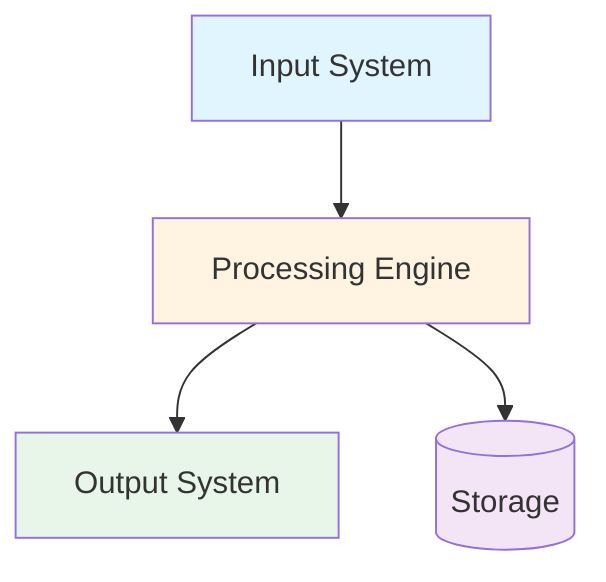
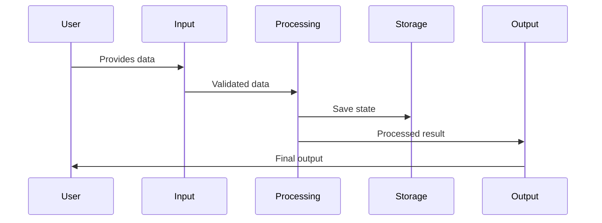
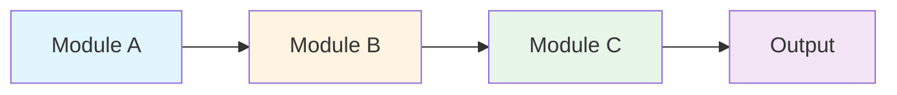
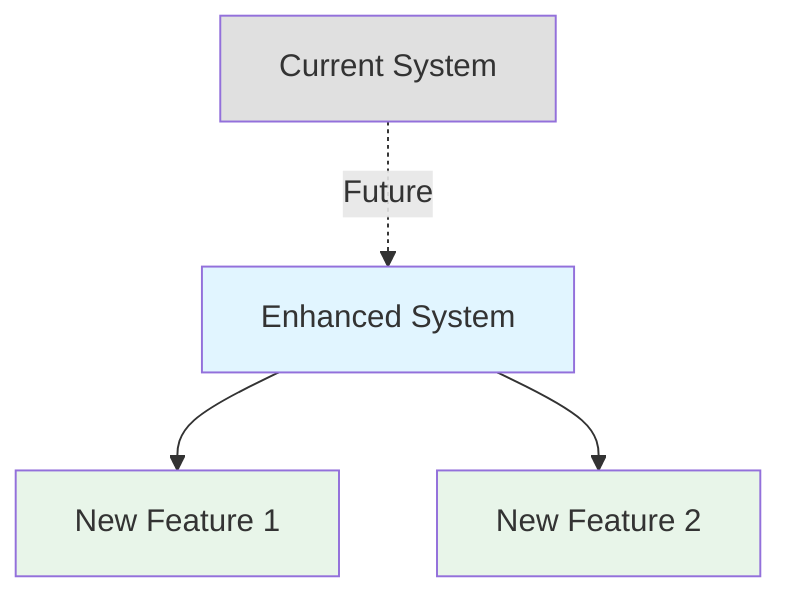

# Architecture: [System Name]

**Last Updated**: [YYYY-MM-DD]
**Owner**: [Your name]

---

## System Overview

**Components**:
- **Input System**: [Purpose and responsibilities]
- **Processing Engine**: [Purpose and responsibilities]
- **Output System**: [Purpose and responsibilities]
- **Storage**: [Purpose and responsibilities]

---

## Data Flow

**Flow Steps**:
1. [Step 1]: [What happens]
2. [Step 2]: [What happens]
3. [Step 3]: [What happens]

---

## Component Details

### [Component Name]

**Responsibilities**:
- [Responsibility 1]
- [Responsibility 2]

**Dependencies**:
- [Dependency 1]
- [Dependency 2]

---

## Future Enhancements

**Planned Additions**:
- [Enhancement 1]: [When and why]
- [Enhancement 2]: [When and why]
