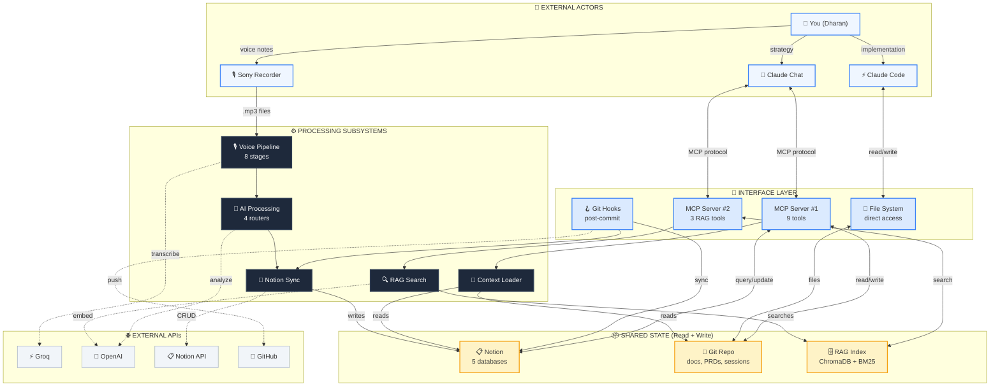

# Container Architecture - Epic 2nd Brain
# Mermaid Source of Truth
# Last Updated: 2024-11-24

## Overview

This is the **builder view** - complete architecture showing how all pieces connect.
For the visual HTML version, see: `visuals/container-architecture.html`

## Diagram

## Data Flows

| # | Flow | Path | Timing |
|---|------|------|--------|
| 1 | Voice → Notion | Sony → Voice Pipeline → AI Processing → Notion | 5-15 min batch |
| 2 | Git → Notion | Commit → Git Hook → Notion Sync → Roadmap/Sessions | 2-5 sec (blocking) |
| 3 | Session Start | start_session() → MCP #1 → Context Loader → Read Notion + Repo | 3-5 sec |
| 4 | RAG Search | Query → MCP #2 → RAG Search → ChromaDB + BM25 → Rerank | ~500ms |
| 5 | Claude Code → Repo | Write file → File System → Git Repo → Commit → Flow #2 | Direct |
| 6 | Handoff (Chat → Code) | end_session() → MCP #1 → Write handoff.md → **Manual copy-paste** | ⚠️ Friction |

## Connection Summary

### Who Talks to What
- **Claude Chat** → MCP Servers (#1 and #2)
- **Claude Code** → File System (direct read/write)
- **Git Commit** → Git Hooks (auto-triggers)
- **Sony USB** → Voice Pipeline (manual trigger)

### Subsystem → API Dependencies
- **Voice Pipeline** → Groq (transcription)
- **AI Processing** → OpenAI (GPT-4)
- **RAG Search** → OpenAI (embeddings) + Local (BGE rerank)
- **Notion Sync** → Notion API + GitHub API

### Shared State Access
- **Notion**: Read by Context Loader, written by Voice Pipeline & Notion Sync
- **Git Repo**: Read by Context Loader & MCP, written by Claude Code & MCP
- **RAG Index**: Read by RAG Search, written by Indexer (manual)

## Related Diagrams

- [System Context](./system-context.mermaid.md) - Executive overview
- [Leverage Points](./leverage-points.mermaid.md) - Where to invest (TODO)
- [Component Inventory](./component-inventory.md) - Detailed code documentation
