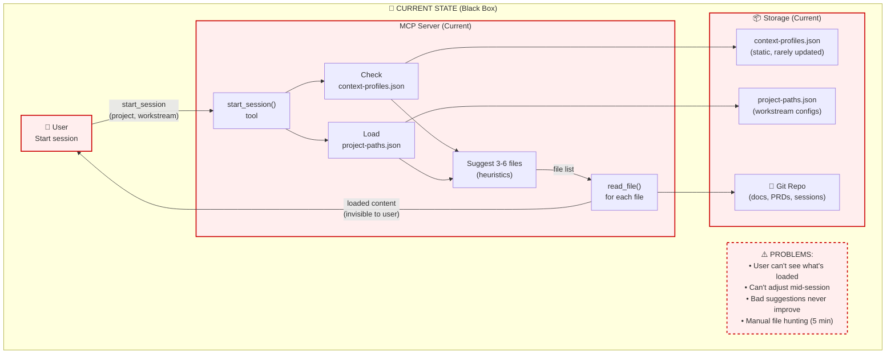

# Context Management Subsystem: Current vs Proposed
# Architecture Deep Dive (Level 4)
# Last Updated: 2024-11-24

## Overview

This diagram shows the current context management architecture and the proposed enhancements for Live Context Control. Split into two views: Current State (what exists today) and Proposed State (Phases 2-4 additions).

---

## Current State Architecture



---

## Proposed State Architecture (Phases 2-4)

```mermaid
flowchart TB
    subgraph ProposedState["🟢 PROPOSED STATE (Intelligent Control)"]
        User2["👤 User<br/>Mid-session control"]
        
        subgraph MCP2["MCP Server (Enhanced)"]
            direction TB
            
            subgraph Phase2["Phase 2: Visibility + Control"]
                ListContext["list_context()<br/>NEW TOOL"]
                ReloadContext["reload_context()<br/>NEW TOOL"]
                SessionState["Session State Tracker<br/>NEW COMPONENT"]
                UsageTracker["Usage Tracker<br/>NEW COMPONENT"]
            end
            
            subgraph Phase3["Phase 3: Smart Discovery"]
                SearchRepo["search_repo()<br/>NEW TOOL"]
                ListFiles["list_files()<br/>NEW TOOL"]
                MiniRAG["Mini-RAG Engine<br/>NEW COMPONENT"]
            end
            
            subgraph Phase4["Phase 4: Learning"]
                Analyzer["Usage Analyzer<br/>NEW COMPONENT"]
                ProfileUpdater["Profile Auto-Updater<br/>NEW COMPONENT"]
            end
            
            StartSession2["start_session()<br/>ENHANCED"]
        end
        
        subgraph Storage2["📦 Storage (Enhanced)"]
            Profiles2["context-profiles.json<br/>(auto-updated by learning)"]
            ProjectPaths2["project-paths.json<br/>(workstream configs)"]
            RepoFiles2["📂 Git Repo"]
            UsageLog["context-usage.jsonl<br/>NEW - tracks behavior"]
            RAGIndex["ChromaDB Index<br/>NEW - semantic search"]
        end
        
        subgraph DataFlows["📊 Data Flows"]
            Flow1["1️⃣ Session Start"]
            Flow2["2️⃣ List Context"]
            Flow3["3️⃣ Search Files"]
            Flow4["4️⃣ Reload Context"]
            Flow5["5️⃣ Track Usage"]
            Flow6["6️⃣ Learn & Improve"]
        end
        
        %% Flow 1: Session Start (enhanced)
        User2 -->|"start_session"| StartSession2
        StartSession2 --> Profiles2
        StartSession2 --> SessionState
        SessionState -->|"track loaded files"| UsageTracker
        
        %% Flow 2: List Context
        User2 -->|"list_context()"| ListContext
        ListContext --> SessionState
        SessionState -->|"show loaded files<br/>with metadata"| User2
        
        %% Flow 3: Search Files
        User2 -->|"search_repo(query)"| SearchRepo
        SearchRepo --> MiniRAG
        MiniRAG --> RAGIndex
        MiniRAG --> RepoFiles2
        MiniRAG -->|"ranked results"| User2
        
        %% Flow 4: Reload Context
        User2 -->|"reload_context<br/>(add, remove)"| ReloadContext
        ReloadContext --> SessionState
        ReloadContext --> RepoFiles2
        ReloadContext -->|"updated context"| SessionState
        
        %% Flow 5: Track Usage
        SessionState -->|"log behavior"| UsageTracker
        UsageTracker --> UsageLog
        
        %% Flow 6: Learn & Improve
        UsageLog --> Analyzer
        Analyzer --> ProfileUpdater
        ProfileUpdater --> Profiles2
        
        Note2["✅ BENEFITS:<br/>• Full visibility (list_context)<br/>• Mid-session control (reload)<br/>• Fast discovery (search)<br/>• Auto-improving (learning)<br/>• 100-140 min/week saved"]
        
        style Note2 fill:#efe,stroke:#0a0,stroke-width:2px
    end
    
    classDef proposed fill:#efe,stroke:#0a0,stroke-width:2px
    classDef new fill:#def,stroke:#06f,stroke-width:2px
    classDef benefit fill:#fff,stroke:#0a0,stroke-width:3px
    
    class User2,MCP2,Storage2 proposed
    class Phase2,Phase3,Phase4,ListContext,ReloadContext,SessionState,UsageTracker,SearchRepo,ListFiles,MiniRAG,Analyzer,ProfileUpdater,UsageLog,RAGIndex new
    class Note2 benefit
```



---

## Component Details

### Current State Components

| Component | Function | Problem |
|-----------|----------|---------|
| `start_session()` | Loads files at session start | One-time only, can't adjust later |
| `context-profiles.json` | Stores learned preferences | Static, never updates from usage |
| `project-paths.json` | Workstream file configs | Generic heuristics, often wrong |
| `read_file()` | Reads individual files | Manual, requires exact path |

---

### New Components (Phase 2: Visibility + Control)

| Component | Function | Benefit |
|-----------|----------|---------|
| **`list_context()` tool** | Shows loaded files with metadata | Make invisible visible |
| **`reload_context()` tool** | Add/remove files mid-session | No more restart spiral |
| **Session State Tracker** | Tracks what's loaded when | Foundation for visibility |
| **Usage Tracker** | Logs file references, adds, removes | Foundation for learning |

**Data Flow Example:**
```
User: "What's in context?"
  ↓ list_context()
  ↓ Session State Tracker
  ↓ Returns: ["ROADMAP.md (2k tokens)", "PRD (6k tokens)", ...]
  ↓ User sees: "Loaded 3 files, 8k tokens, 5% of window"
```

---

### New Components (Phase 3: Smart Discovery)

| Component | Function | Benefit |
|-----------|----------|---------|
| **`search_repo()` tool** | Semantic search over repo | Find files by content, not path |
| **`list_files()` tool** | Browse by glob pattern | Explore structure easily |
| **Mini-RAG Engine** | ChromaDB + embeddings + BM25 | Fast, accurate search (<2 sec) |

**Data Flow Example:**
```
User: "Find PRDs about sessions"
  ↓ search_repo(query="sessions", file_types=["prd"])
  ↓ Mini-RAG Engine
  ↓ Query ChromaDB (semantic) + BM25 (keyword)
  ↓ Returns: ["context-sync-bridge.md (score: 0.89)", ...]
  ↓ User: "Load #1"
  ↓ reload_context(add=["context-sync-bridge.md"])
```

---

### New Components (Phase 4: Learning Loop)

| Component | Function | Benefit |
|-----------|----------|---------|
| **Usage Analyzer** | Analyzes context-usage.jsonl | Identifies patterns |
| **Profile Auto-Updater** | Updates context-profiles.json | Suggestions improve over time |

**Learning Flow Example:**
```
After 10 sessions with "systems-architecture":
  ↓ Usage Analyzer reads context-usage.jsonl
  ↓ Finds pattern: "Dharan always removes component-inventory.md"
  ↓ Finds pattern: "Dharan always adds PRDs"
  ↓ Profile Auto-Updater updates context-profiles.json
  ↓ Next session: Don't suggest component-inventory, do suggest PRDs
```

---

## Key Technical Decisions

### Decision 1: Mini-RAG vs Simple Search (Phase 3)

**Current Corpus**: ~50k tokens (Epic 2nd Brain docs only)

**Options:**
- **A: Simple ripgrep** - Fast keyword search, no embeddings
- **B: Mini-RAG** - Semantic search with ChromaDB

**Recommendation**: Start with ripgrep (simpler), monitor usage in Phase 2, upgrade to RAG if needed

**Why**: Corpus might be too small to justify RAG overhead. Can add later if search quality insufficient.

---

### Decision 2: Session State Storage

**Options:**
- **A: In-memory** - Fast but lost on MCP restart
- **B: SQLite** - Persistent, queryable
- **C: JSON file** - Simple, file-based

**Chosen**: JSON file (`~/.cache/epic-2nd-brain/session-state.json`)

**Why**: Simple, persistent, compatible with existing context-profiles.json pattern. Can upgrade to SQLite if performance becomes issue.

---

### Decision 3: Usage Tracking Scope

**What to track:**
- ✅ Files loaded at start (from suggestions)
- ✅ Files added mid-session (explicit positive signal)
- ✅ Files removed mid-session (explicit negative signal)
- ✅ Files referenced in responses (implicit positive signal)

**What NOT to track:**
- ❌ Conversation content (privacy)
- ❌ User queries (privacy)
- ❌ Response quality ratings (out of scope)

**Why**: Focus on file usage patterns only, respect privacy, keep learning loop simple.

---

## Data Flows Detailed

### Flow 1: Enhanced Session Start

```
1. User: start_session("Epic 2nd Brain", "systems-architecture")
2. MCP: Check context-profiles.json (learned preferences)
3. MCP: Check project-paths.json (workstream config)
4. MCP: Load always-files (ROADMAP.md, one-pager)
5. MCP: Suggest 3-6 additional files (based on profile OR heuristics)
6. User: Confirms or adjusts
7. MCP: read_file() for each selected file
8. Session State Tracker: Log loaded files with metadata
9. Usage Tracker: Start tracking session
```

**Time**: <10 seconds (same as current)

---

### Flow 2: Mid-Session Visibility

```
1. User: "What's in context?"
2. MCP: list_context()
3. Session State Tracker: Returns loaded files list
4. Format response:
   - ROADMAP.md (2k tokens, loaded 10:15am, reason: always-loaded)
   - leverage-points.md (8k tokens, loaded 10:15am, reason: workstream suggestion)
   - Total: 10k tokens, 7% of context window
5. User sees full inventory
```

**Time**: <5 seconds

---

### Flow 3: Mid-Session Adjustment

```
1. User: "Remove leverage-points, add the Context Sync Bridge PRD"
2. MCP: reload_context(
     remove=["leverage-points.md"],
     add=["docs/prd/context-sync-bridge.md"]
   )
3. Session State Tracker: Update loaded files
4. Usage Tracker: Log adjustment (negative signal for leverage-points, positive for PRD)
5. MCP: Confirm "Removed leverage-points (8k tokens), loaded PRD (6k tokens)"
6. Conversation continues seamlessly
```

**Time**: <30 seconds

---

### Flow 4: Smart File Discovery

```
1. User: "Find PRDs about sessions"
2. MCP: search_repo(query="sessions", file_types=["prd"])
3. Mini-RAG Engine:
   a. Query ChromaDB (semantic embeddings)
   b. Query BM25 index (keyword matching)
   c. Merge results (hybrid ranking)
   d. Return top 5
4. MCP: Display results with snippets
5. User: "Load #1"
6. MCP: reload_context(add=["context-sync-bridge.md"])
```

**Time**: <2 seconds for search, <30 seconds total with load

---

### Flow 5: Usage Tracking (Silent)

```
During session:
1. User asks: "What did we decide about git hooks?"
2. MCP generates response citing "context-sync-bridge.md"
3. Usage Tracker logs:
   {
     "timestamp": "2025-11-25T10:30:00Z",
     "file": "context-sync-bridge.md",
     "referenced": true,
     "context": "User asked about git hooks"
   }
4. Continues silently (user doesn't see logging)
```

**Storage**: Append to `context-usage.jsonl` (one line per event)

---

### Flow 6: Learning (Weekly)

```
After 2-3 weeks (10-15 sessions):
1. Usage Analyzer reads context-usage.jsonl
2. Analyzes patterns for "systems-architecture" workstream:
   - component-inventory.md: Suggested 12 times, removed 10 times → NEVER suggest
   - PRDs: Suggested 5 times, kept 5 times, added manually 7 more times → ALWAYS suggest
   - ROADMAP.md: Referenced in 95% of sessions → Confirm always-loaded
3. Profile Auto-Updater writes to context-profiles.json:
   {
     "Epic 2nd Brain": {
       "systems-architecture": {
         "always_files": ["ROADMAP.md"],
         "suggested_files": ["docs/prd/*.md"],
         "excluded_files": ["component-inventory.md"]
       }
     }
   }
4. Next session: Suggestions reflect learned patterns
```

**Frequency**: Weekly (could be manual trigger or cron job)

---

## Implementation Phasing

### Phase 2 (Week 1): Build Foundation
- Session State Tracker (stores what's loaded)
- Usage Tracker (logs behavior)
- list_context() tool (visibility)
- reload_context() tool (control)
- Always-files config (ROADMAP.md)

**Output**: Users can see and adjust context mid-session

---

### Phase 3 (Week 2): Add Intelligence
- Mini-RAG Engine OR simple ripgrep (TBD based on Phase 2 data)
- search_repo() tool
- list_files() tool
- ChromaDB index (if RAG chosen)

**Output**: Users can discover files without manual navigation

---

### Phase 4 (Week 3): Enable Learning
- Usage Analyzer (processes logs)
- Profile Auto-Updater (writes learned preferences)
- Integration with start_session() (use learned profiles)

**Output**: Suggestions improve automatically from usage

---

## Risk Analysis

**Low Risk:**
- ✅ Builds on proven MCP infrastructure (already operational)
- ✅ Progressive rollout (each phase delivers independent value)
- ✅ Fail-safe: If new tools break, old start_session() still works

**Medium Risk:**
- ⚠️ Mini-RAG might be overkill for small corpus (mitigation: start simple, upgrade if needed)
- ⚠️ Usage tracking could feel creepy (mitigation: transparent, user-controlled, privacy-preserving)

**No High Risk identified**

---

## Success Metrics

| Metric | Current | Phase 2 | Phase 3 | Phase 4 |
|--------|---------|---------|---------|---------|
| Context adjustment time | 5 min (restart) | 30 sec | 30 sec | 30 sec |
| File discovery time | 5 min (manual) | 5 min | 10 sec | 10 sec |
| Suggestion accuracy | 30% | 30% | 30% | 80% |
| Restart spirals/week | 3-5 | 0 | 0 | 0 |
| Time saved/week | 0 | 45 min | 80-110 min | 100-140 min |

---

## Next Steps

1. **This Week (Nov 25-29)**: Phase 2 implementation
2. **Week of Dec 2**: Phase 3 (decide RAG vs simple at kickoff)
3. **Week of Dec 9**: Phase 4 (use accumulated data from Phases 2-3)
4. **Dec 13**: Complete, measure ROI, update roadmap

---

**Related Diagrams:**
- [System Context](./system-context.mermaid.md) - Level 1
- [Container Architecture](./container-architecture.mermaid.md) - Level 2
- [Leverage Points](./leverage-points.mermaid.md) - Level 3
- This document - Level 4 (Context Management Deep Dive)

---

**End of Architecture Deep Dive**
