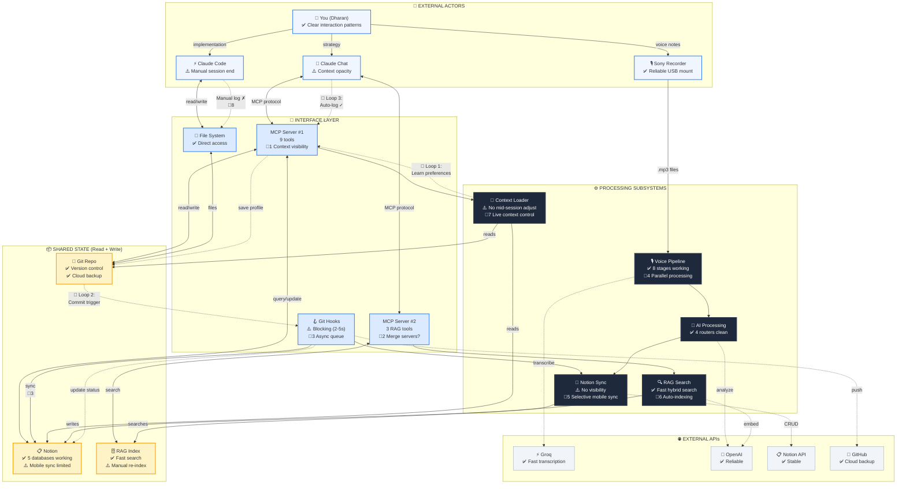

# Leverage Points Analysis - Epic 2nd Brain
# Mermaid Source of Truth
# Last Updated: 2024-11-24

## Overview

This is the **decision view** - same architecture as Container diagram, but annotated with:
- ✅ Working well (leave alone)
- ⚠️ Friction points (opportunities for improvement)
- 🎯 High-leverage intervention points (numbered, see table below)
- 🔄 Critical feedback loops (drawn as curved arrows)

For the visual HTML version, see: `visuals/leverage-points.html`

## Diagram



## Legend

### Status Markers
- **✅ Working well**: Leave alone, don't over-optimize
- **⚠️ Friction point**: Known pain, improvement opportunity
- **🎯 High-leverage intervention**: Numbered (see table below)

### Feedback Loops (Curved arrows on diagram)
- **🔄 Loop 1**: Context Learning (Reinforcing, WORKING)
- **🔄 Loop 2**: Git-Notion Sync (Balancing, FRICTION)
- **🔄 Loop 3**: Session Documentation (BROKEN - your Priority #1)

---

## Intervention Opportunities (Ranked by Leverage)

| # | Intervention | Component | Leverage Point | Estimated ROI | Your Priority? |
|---|--------------|-----------|----------------|---------------|----------------|
| 🎯8 | **Unified Session End** | Chat + Code | #5 Rules | **HIGH** - 10-15 min saved per Code session | ✅ Priority #1 |
| 🎯5 | **Selective Notion Sync** | Sync subsystem | #6 Info Flows | **HIGH** - Mobile access to key files | ✅ Priority #2 |
| 🎯1 | **Live Context Control** | MCP Server #1 | #6 Info Flows | **HIGH** - See what's loaded, adjust mid-session | New opportunity |
| 🎯7 | **Context Visibility** | Context Loader | #6 Info Flows | **MEDIUM** - Related to 🎯1, show loaded files | New opportunity |
| 🎯6 | **Auto-RAG Indexing** | RAG subsystem | #5 Rules | **MEDIUM** - Eliminate manual re-index step | New opportunity |
| 🎯3 | **Async Git Hook** | Git Hooks | #9 Delays | **MEDIUM** - Remove 2-5s commit blocking | New opportunity |
| 🎯4 | **Parallel Transcription** | Voice Pipeline | #9 Delays | **LOW** - Faster batch processing (rarely bottleneck) | New opportunity |
| 🎯2 | **Unified MCP Servers** | MCP #1 + #2 | #10 Structure | **LOW** - Simpler (2 processes → 1), but working fine now | New opportunity |

### Priority Ranking Rationale

**Tier 1 - Do First (🎯8, 🎯5, 🎯1):**
- **🎯8 Unified Session End**: Your stated Priority #1. Fixes broken Loop #3. High frequency (every Code session). Clear pain point.
- **🎯5 Selective Notion Sync**: Your stated Priority #2. Enables mobile workflow. Leverages existing git hook infrastructure.
- **🎯1 Live Context Control**: Newly identified blind spot. Amplifies Loop #1 (context learning). High frequency (every Chat session). Info Flow leverage point.

**Tier 2 - Do Later (🎯7, 🎯6, 🎯3):**
- **🎯7 Context Visibility**: Foundation for 🎯1, could be bundled together
- **🎯6 Auto-RAG Indexing**: Eliminates manual step (Rules leverage), but low frequency (only when corpus changes)
- **🎯3 Async Git Hook**: Removes friction in Loop #2, but 2-5s delay is minor annoyance not blocker

**Tier 3 - Nice to Have (🎯4, 🎯2):**
- **🎯4 Parallel Transcription**: Delay reduction, but voice pipeline rarely bottlenecks now
- **🎯2 Unified MCP Servers**: Cleaner structure, but current 2-server setup works fine

---

## Detailed Intervention Analysis

### 🎯8 Unified Session End (PRIORITY #1)

**Current Pain**:
- Claude Chat: `end_session()` tool → auto-creates log, updates Notion ✅
- Claude Code: Manual `python scripts/end_session.py` → inconsistent, often forgotten ✗
- No auto-detection of session boundaries
- Handoff from Chat → Code is manual copy-paste

**Systems Thinking**:
- **Leverage Point**: #5 Rules (add auto-triggering rules)
- **Feedback Loop**: Loop #3 (Session Documentation) is BROKEN for Claude Code
- **Delay**: No session timer, duration must be manually entered

**Proposed Solution**:
1. **Unified `end_session` command** that works in both Chat and Code
2. **Auto-detect session start** → start timer when first tool call happens
3. **Prompt for session end** → When closing Code, ask "End session now?"
4. **Handoff queue** → Chat writes handoff to shared location, Code checks on startup
5. **Session state persistence** → MCP server maintains session metadata across tool calls

**Implementation Estimate**: 8-12 hours
- 3-4 hours: Session state management in MCP server
- 2-3 hours: Unified end_session command
- 2-3 hours: Handoff queue system (file-based or simple DB)
- 1-2 hours: Testing across Chat + Code

**2x Success Criteria**:
- Session end takes <2 min (from current ~10-15 min manual logging)
- Handoff copy-paste eliminated (auto-pickup from queue)
- 100% of Code sessions logged (from current ~50% manual rate)

---

### 🎯5 Selective Notion Sync (PRIORITY #2)

**Current Pain**:
- Git hook syncs session logs + roadmap updates to Notion ✅
- But: PRDs, tech requirements, handoffs stay in Git only ✗
- Mobile access limited to what's already in Notion databases
- Can't review detailed docs on phone

**Systems Thinking**:
- **Leverage Point**: #6 Info Flows (make git content accessible on mobile)
- **Feedback Loop**: Loop #2 (Git-Notion Sync) works for some files, not others
- **Stock**: Notion has partial view of Repo content

**Proposed Solution**:
1. **Tag-based sync** → Add YAML frontmatter to markdown files:
   ```yaml
   ---
   sync_to_notion: true
   notion_page_id: abc123  # optional, creates new page if omitted
   ---
   ```
2. **Expand git hook** → Check for `sync_to_notion: true`, push to Notion page content
3. **Bidirectional links** → Notion page links back to GitHub for full version control
4. **Selective sync** → Only files you tag (PRDs, key handoffs, not everything)

**Implementation Estimate**: 6-8 hours
- 2-3 hours: YAML frontmatter parser
- 2-3 hours: Notion page content writer (convert markdown → Notion blocks)
- 1-2 hours: Update git hook logic
- 1 hour: Testing + documentation

**2x Success Criteria**:
- Key docs (PRDs, handoffs) accessible on mobile within 5 sec of commit
- Sync adds <1 sec to commit time (currently 2-5s for sessions/roadmap only)

---

### 🎯1 Live Context Control (NEW OPPORTUNITY - HIGH LEVERAGE)

**Why This Matters** (Blind Spot):
You have intelligent context loading at session start, but no way to:
- See what files are loaded mid-session
- Adjust context when conversation shifts direction
- Remove noisy files without restarting
- Add missing files when you realize you need them

This is a **high-frequency pain** (every Chat session where topic shifts) that you may not consciously notice because you've adapted by manually asking "read file X" or restarting sessions.

**Systems Thinking**:
- **Leverage Point**: #6 Info Flows (make invisible visible)
- **Feedback Loop**: Loop #1 (Context Learning) is good but could be GREAT with visibility
- **Amplification**: Small change (show what's loaded) → big impact (faster context adjustments)

**Proposed Solution**:
1. **`list_context()` tool** → Show currently loaded files with timestamps
2. **`reload_context(add=[...], remove=[...])` tool** → Adjust without restarting
3. **Visual indicator** → MCP server prints "📂 Loaded 5 files" with list
4. **Auto-suggest additions** → When you mention unfamiliar terms, suggest related files

**Implementation Estimate**: 4-6 hours
- 2-3 hours: Session state tracking in MCP server (which files loaded when)
- 1-2 hours: list_context + reload_context tools
- 1 hour: Testing + UX polish

**2x Success Criteria**:
- Context adjustments take <30 sec (from current ~5 min to restart + reload)
- 80% of sessions don't need restart due to missing/extra files

---

### 🎯7 Context Visibility (Related to 🎯1)

**Current Pain**:
- start_session suggests 3-6 files ✅
- But: No explanation of WHY those files were suggested
- Heuristics are opaque (workstream config or generic logic)
- Can't easily tell if suggestion is smart or dumb

**Proposed Solution**:
- **`explain_suggestions()` tool** → Show reasoning: "Suggested X because: workstream=synthesis, file_type=latest"
- Could bundle with 🎯1 as single "context transparency" feature

**Implementation Estimate**: 2-3 hours (if bundled with 🎯1)

---

### 🎯6 Auto-RAG Indexing (NEW OPPORTUNITY - MEDIUM LEVERAGE)

**Current Pain**:
- When you add new customer interviews to legacy-ai/research/, RAG doesn't know
- Must manually run `python scripts/rag/indexer.py` to re-index
- Easy to forget → search results get stale

**Systems Thinking**:
- **Leverage Point**: #5 Rules (add auto-triggering rule)
- **Stock**: RAG Index becomes stale when Corpus changes
- **Flow**: Manual re-indexing is low-frequency but error-prone

**Proposed Solution**:
1. **File watcher** → Monitor `~/Documents/1. Projects/legacy-ai/research/**/*.md`
2. **Incremental indexing** → Only re-embed changed files (not full corpus)
3. **Auto-trigger** → When file changes detected, queue re-index job
4. **Background process** → Don't block other work

**Implementation Estimate**: 6-8 hours
- 3-4 hours: File watcher + change detection logic
- 2-3 hours: Incremental indexing (delta updates)
- 1 hour: Testing

**2x Success Criteria**:
- Zero manual re-index commands after adding new interviews
- Index freshness <1 min after file save

---

### 🎯3 Async Git Hook (NEW OPPORTUNITY - MEDIUM LEVERAGE)

**Current Pain**:
- Git commit → waits for Notion sync (2-5 sec) → annoying delay
- If Notion API fails, error is silent (just logged to stderr)
- No retry logic (failed syncs are lost)

**Systems Thinking**:
- **Leverage Point**: #9 Delays (shorten feedback delay)
- **Feedback Loop**: Loop #2 (Git-Notion Sync) is synchronous, blocks commit
- **Resilience**: No queue means no retry on failure

**Proposed Solution**:
1. **Queue-based sync** → Commit writes to local queue (instant), background worker syncs to Notion
2. **Retry logic** → Exponential backoff on Notion API failures
3. **Status command** → `git notion-status` shows sync queue and last sync
4. **Visibility** → Print summary after sync completes (async, doesn't block)

**Implementation Estimate**: 8-10 hours
- 4-5 hours: Queue system (SQLite or simple JSON file)
- 2-3 hours: Background worker daemon
- 1-2 hours: Status command + visibility
- 1 hour: Testing

**2x Success Criteria**:
- Commit completes in <1 sec (from current 2-5 sec)
- Zero lost syncs due to API failures (retry until success)

---

### 🎯4 Parallel Transcription (LOW PRIORITY)

**Current Pain**:
- Voice pipeline transcribes files sequentially (one at a time)
- Batch of 20 files takes ~15-20 min
- Could be faster with parallel processing

**Why LOW Priority**:
- Voice pipeline is rarely a bottleneck (you process recordings once per day)
- 15-20 min is acceptable for end-of-day batch
- Risk: Parallel processing could hit Groq rate limits (20 req/min)

**Proposed Solution** (if pursued):
- Worker pool (3-5 workers) with rate limit coordination
- Estimate: 4-6 hours

---

### 🎯2 Unified MCP Servers (LOW PRIORITY)

**Current Pain**:
- Two separate MCP servers (main + RAG) running on different ports
- Must configure both in Claude Desktop config
- Slightly more complex to maintain

**Why LOW Priority**:
- Current setup works fine, no functional pain
- Merging would be cleaner but not urgent
- Risk: Could introduce bugs if not careful

**Proposed Solution** (if pursued):
- Merge RAG tools into main MCP server
- Estimate: 3-4 hours

---

## Feedback Loop Analysis

### 🔄 Loop 1: Context Learning (Reinforcing - WORKING BUT COULD BE STRONGER)

**Structure**:
```
User selects files → save_context_profile → Next session loads learned files → 
Better suggestions → More usage → More learning → (repeat)
```

**Current State**: ✅ WORKING
- Phase 2 intelligent loading is operational (Nov 2025)
- User selections saved to context-profiles.json
- Next session auto-loads learned preferences
- Virtuous cycle: system gets smarter with use

**Friction Points**:
- No visibility into WHY suggestions were made (opaque heuristics)
- No mid-session adjustments (must restart to change context)
- Learning is per-project+workstream (doesn't generalize across workstreams)

**Amplification Opportunity**: 🎯1 + 🎯7
- Add context visibility → user sees what's loaded and why
- Add live control → user adjusts on the fly → better learning signal
- System learns from mid-session adjustments, not just startup selections
- Result: Loop 1 spins faster, suggestions get better quicker

---

### 🔄 Loop 2: Git-Notion Sync (Balancing - WORKING WITH FRICTION)

**Structure**:
```
Git commit → Post-commit hook → Notion sync → Roadmap updated → 
User sees status → (balances to accurate state)
```

**Current State**: ⚠️ WORKING BUT FRICTION
- Sync happens automatically on every commit ✅
- Roadmap stays in sync with git history ✅
- But: 2-5 sec blocking delay (annoying) ⚠️
- But: No visibility (user doesn't see what synced) ⚠️
- But: No retry (failures are silent) ⚠️

**Why This Is Balancing**:
- Goal: Keep Notion dashboard accurate (target state)
- Sensor: Git commits trigger sync (measure actual state)
- Corrective action: Update Notion to match git (close gap)
- Equilibrium: Notion reflects latest git state

**Friction Points**:
- Delay: 2-5 sec synchronous wait
- Opacity: No summary of what synced
- Fragility: No retry on Notion API failures

**Improvement Opportunity**: 🎯3 + 🎯5
- 🎯3 Async queue → Remove blocking delay, add retry logic
- 🎯5 Selective sync → Expand to PRDs/handoffs for mobile access
- Result: Loop 2 works faster, more reliably, covers more content

---

### 🔄 Loop 3: Session Documentation (BROKEN FOR CODE - YOUR PRIORITY #1)

**Structure** (Intended):
```
Session work → Capture metadata → Create log → Update Notion → 
User reviews → (balances to complete documentation)
```

**Current State**: 
- **Claude Chat**: ✅ WORKING
  - end_session tool → auto-creates log → updates Notion → consistent
- **Claude Code**: ❌ BROKEN
  - Manual `python scripts/end_session.py` → inconsistent → often forgotten
  - No auto-detection of session boundaries
  - No timer for duration tracking

**Why This Loop Is Critical**:
- Session logs are your "second brain" memory
- Handoffs depend on good logs (Chat → Code transition)
- Without consistent logging, context degrades over time

**Broken Feedback**:
- Code sessions → No automatic capture → Logs missing → Future context worse → More time reloading → (vicious cycle)

**Fix**: 🎯8 Unified Session End
- Make Code session end as automatic as Chat
- Auto-detect session boundaries → start timer
- Prompt for end on close → capture metadata
- Handoff queue → eliminate copy-paste
- Result: Loop 3 closes reliably for both Chat and Code

---

## Systems Thinking Summary

### Meadows' Leverage Point Analysis

**High-Leverage Points Present** (#6, #5, #9):

1. **#6 Information Flows** (Most Important):
   - 🎯1 Live Context Control: Make loaded files visible, adjustable
   - 🎯7 Context Visibility: Explain WHY files were suggested
   - 🎯5 Selective Notion Sync: Flow git content to mobile
   - Loop 1 amplification: Better visibility → better learning

2. **#5 Rules** (Very Important):
   - 🎯8 Unified Session End: Auto-trigger rules for Code (like Chat has)
   - 🎯6 Auto-RAG Indexing: Auto-trigger re-index when corpus changes
   - Loop 3 fix: Add rules that make Code session end automatic

3. **#9 Delays** (Important):
   - 🎯3 Async Git Hook: Remove 2-5s commit blocking
   - 🎯4 Parallel Transcription: Faster batch processing (low ROI)
   - Loop 2 improvement: Faster feedback from commit to Notion

**Lower-Leverage Points** (#10):
4. **#10 Material Structures** (Nice to Have):
   - 🎯2 Unified MCP Servers: Cleaner structure (2 processes → 1)
   - Works fine now, optimization not urgent

### What's Working Well (Leave Alone)

**Don't Over-Optimize These**:
- ✅ Voice Pipeline orchestration (8 stages clean, modular)
- ✅ AI routing (4 specialized routers, well-factored)
- ✅ RAG hybrid search (fast, accurate)
- ✅ Groq transcription (10x faster than alternatives)
- ✅ Git + GitHub backup (reliable, version-controlled)
- ✅ Notion databases (5 databases working, good schema)
- ✅ MCP protocol integration (stable, proven)

### Recommended Investment Priority

**Next Sprint (10-20 hours)**:
1. **🎯8 Unified Session End** (8-12 hours) - Your Priority #1
2. **🎯5 Selective Notion Sync** (6-8 hours) - Your Priority #2
3. **🎯1 Live Context Control** (4-6 hours) - Newly identified high-leverage

**Total**: 18-26 hours (realistic for one sprint)

**Later Sprints**:
- 🎯7 Context Visibility (bundle with 🎯1)
- 🎯6 Auto-RAG Indexing (when corpus grows)
- 🎯3 Async Git Hook (when delay becomes annoying)

**Defer / Not Worth It**:
- 🎯4 Parallel Transcription (rarely bottlenecks)
- 🎯2 Unified MCP Servers (working fine now)

---

## Related Diagrams

- [System Context](./system-context.mermaid.md) - Executive overview
- [Container Architecture](./container-architecture.mermaid.md) - How pieces connect (base for this diagram)
- [Component Inventory](./component-inventory.md) - Detailed code documentation

---

**End of Leverage Points Analysis**
