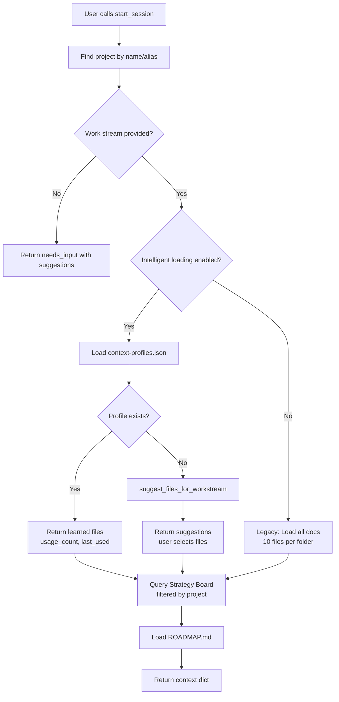
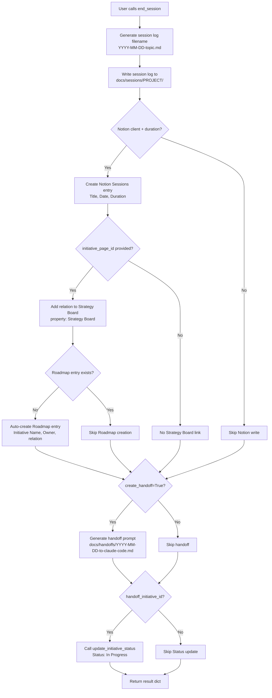

# MCP Server Current State Analysis

**Date**: 2025-12-05
**Analyzed By**: Claude Code
**Purpose**: Inform comprehensive PRD rewrite for "state-of-the-art" MCP tool

---

## Executive Summary

The current MCP server is a **single FastMCP server** (`full_server.py`, 1,881 lines) that exposes **9 tools** for managing context across 3 projects (Epic 2nd Brain, Legacy AI, Lifeadmin). The architecture is **functional but cluttered**, with major friction points causing **100-140 min/week of waste**.

### Key Findings:
- ✅ **Working Well**: read_file, write_file, query_strategy_board, update_initiative_status
- ⚠️ **Partially Working**: start_session (intelligent loading exists but not adopted), search_docs (basic keyword search only)
- ❌ **Broken/Missing**: end_session Notion description population, in-repo semantic search, Claude Code handoff auto-detection
- 🔴 **Critical Gap**: Tool selection priority—Claude defaults to bash/view instead of MCP tools

### Recommendation: **REFACTOR (70%), REWRITE (30%)**
- Refactor: Context loading, tool descriptions, file organization
- Rewrite: Session handoff protocol, in-repo search (add RAG), tool prioritization signals

---

## 1. Current Architecture

### File Structure

```
/Users/dharanchandrahasan/Documents/1. Projects/ai-assistant/
├── mcp_server/
│   ├── full_server.py          # Main MCP server (1,881 lines)
│   └── simple_server.py         # Minimal example (unused)
├── docs/
│   ├── config/
│   │   ├── context-profiles.json        # Learned context profiles
│   │   ├── project-paths.json           # Project configuration
│   │   ├── agent-detection-patterns.json
│   │   └── file-type-patterns.json
│   ├── prd/                     # 12 PRD files
│   ├── tech-requirements/       # 7 tech-req files
│   ├── sessions/
│   │   ├── claude-chat/         # Session logs from Claude Chat
│   │   └── claude-code/         # Session logs from Claude Code
│   ├── context/                 # 12 context files
│   ├── architecture/            # 12 architecture docs
│   ├── handoffs/                # Handoff prompts
│   └── archive/                 # Old files
├── scripts/                     # Processing scripts (30 files)
├── processed/                   # Voice recording outputs (290 files)
├── logs/                        # 21 log files
└── ROADMAP.md
```

**Total markdown files in docs/**: 102 files

### Server Architecture

**This is ONE server** (`full_server.py`) that:
- Uses FastMCP framework
- Manages 3 projects via `PROJECT_CONFIG` dict
- Connects to Notion (3 databases: Strategy Board, Sessions, Roadmap)
- Stores learned profiles in `context-profiles.json`

### State Storage

| Data | Location | Format |
|------|----------|--------|
| **Learned Profiles** | `docs/config/context-profiles.json` | JSON (project → workstream → files) |
| **Project Config** | `docs/config/project-paths.json` | JSON (aliases, folders, workstreams) |
| **File Type Patterns** | `docs/config/file-type-patterns.json` | JSON (workstream → file types) |
| **Strategy Board** | Notion Database | Live API calls |
| **Sessions** | Notion Database | Live API calls |
| **Roadmap** | Notion Database | Live API calls |

### Data Model: Context Profiles

```json
{
  "profiles": {
    "<Project Name>": {
      "<workstream>": {
        "created": "2025-11-17T20:47:55Z",
        "last_used": "2025-11-17T20:47:55Z",
        "usage_count": 1,
        "files": [
          {
            "path": "research/customer-interviews/analyses/2025-ripanshi.md",
            "type": "optional",  // optional, always, exemplar, synthesis
            "added": "2025-11-17T20:47:55Z"
          }
        ]
      }
    }
  }
}
```

**File Types**:
- `always`: Core files (loaded every time)
- `optional`: Suggested files (user can decline)
- `exemplar`: Example/template files
- `synthesis`: Summary/meta-analysis files

---

## 2. Tool Inventory

### Complete Tool List (9 tools)

| # | Tool Name | Parameters | Status | Issues |
|---|-----------|-----------|--------|---------|
| 1 | `read_file` | path, project | ✅ Working | None—reliable and fast |
| 2 | `write_file` | path, content, project | ✅ Working | None—enables Claude Chat PRD creation |
| 3 | `start_session` | project_name, work_stream, debug, use_intelligent_loading | ⚠️ Partial | Intelligent loading not adopted (defaults to legacy mode), no auto-detect handoffs |
| 4 | `end_session` | project_name, summary, duration, decisions, next_steps, initiative_page_id, create_handoff | ❌ Broken | Does NOT populate Notion page content (description field), only properties |
| 5 | `search_docs` | query, doc_types, project_name | ⚠️ Partial | Basic keyword search only (no semantic search, no RAG) |
| 6 | `query_strategy_board` | filter_status, limit, project_name | ✅ Working | None—reliable Notion integration |
| 7 | `update_initiative_status` | page_id, new_status, decision_notes, launch_notes, completed_date | ✅ Working | None—appends decision notes correctly |
| 8 | `write_to_page_content` | page_id, content, fallback_path | ✅ Working | V1 markdown→Notion conversion (no tables/images) |
| 9 | `save_context_profile` | project_name, work_stream, selected_file_indices, suggested_files | ✅ Working | None—saves learned profiles |

### Tools by Functional Category

**Context Loading (2 tools)**:
- `start_session` - Auto-loads context, suggests files, queries Strategy Board
- `save_context_profile` - Saves user file selections as learned profiles

**File Operations (2 tools)**:
- `read_file` - Read files from project repos
- `write_file` - Write files to project repos (PRDs, session logs, etc.)

**Search (1 tool)**:
- `search_docs` - Keyword search across all projects (basic, no RAG)

**Session Management (1 tool)**:
- `end_session` - Create session log, write to Notion Sessions DB, auto-create Roadmap entry

**Notion Operations (3 tools)**:
- `query_strategy_board` - Get top initiatives filtered by project/status
- `update_initiative_status` - Update Status, Decision Notes, Launch Notes
- `write_to_page_content` - Write markdown to Notion page body

---

## 3. Context Loading Flow (`start_session`)

### Trace: What Happens When Dharan Says `start_session("infrastructure")`



### Key Functions

**1. `find_project(project_name)`** (line ~1454):
- Loads `project-paths.json`
- Matches project name or aliases (e.g., "infrastructure" → "Epic 2nd Brain")
- Returns project config with root_path, folders_to_scan, workstreams

**2. `load_profile(project, workstream)`** (line ~1600):
- Loads `context-profiles.json`
- Returns profile if exists, else None

**3. `suggest_files_for_workstream(project, workstream)`** (line ~1650):
- Loads `file-type-patterns.json`
- Scans folders based on workstream config
- Returns 3-6 files ranked by recency and type

**4. Legacy Behavior** (lines 334-362):
- Scans all `context_folders` from PROJECT_CONFIG
- Loads 10 most recent .md files per folder
- No intelligence—just recency sort

### Current Adoption: **Low**

**Why**: Claude Chat defaults to `use_intelligent_loading=False` (legacy mode loads 10-16 files, causing clutter).

**Root Cause**: Tool description doesn't emphasize intelligent loading as PRIMARY behavior.

---

## 4. Session Handoff Flow (`end_session`)

### Trace: What Gets Written Where?



### What Gets Updated

| Destination | What's Written | How |
|-------------|----------------|-----|
| **Local Session Log** | Summary, decisions, next steps | Markdown file in `docs/sessions/<project>/` |
| **Notion Sessions DB** | Title, Session Date, Duration, Strategy Board relation | `notion_client.pages.create()` with properties only |
| **Notion Roadmap DB** | Initiative Name, Owner, Strategy Board relation (if missing) | Auto-created if doesn't exist |
| **Strategy Board Page** | Status → "🚀 In Progress", Decision Notes (appended) | `update_initiative_status()` tool |
| **Handoff Prompt** | Summary, decisions, next steps, PRD path, one-pager location | Markdown template in `docs/handoffs/` |

### What Does NOT Get Updated

❌ **Notion Sessions page content (description field)** - Only properties are set, no body content written.

**Why**: `end_session()` calls `notion_client.pages.create()` with only `properties`, not `children` (blocks).

**Fix Required**: Call `write_to_page_content()` after creating Sessions entry to populate description.

---

## 5. End-Session Protocol Analysis

### What SHOULD `end_session()` Update?

| Update | Current Behavior | Gap |
|--------|------------------|-----|
| **Local session log** | ✅ Written to `docs/sessions/<project>/YYYY-MM-DD-topic.md` | None |
| **Notion Sessions entry** | ✅ Creates entry with Title, Date, Duration, Strategy Board relation | ❌ Description field empty |
| **Roadmap entry** | ✅ Auto-creates if missing (Initiative Name, Owner, relation) | None |
| **Strategy Board status** | ✅ Updates to "🚀 In Progress" if handoff_initiative_id provided | None |
| **Handoff prompt** | ✅ Creates `docs/handoffs/` file if create_handoff=True | None |
| **Git commit message** | ⚠️ Returns suggestion but doesn't execute | User must run manually |

### MCP Tool Problem vs. Prompt/Rules Problem?

**This is an MCP tool problem** (not a prompt problem).

**Root Cause**: `end_session()` calls `notion_client.pages.create()` with only `properties`, missing `children` parameter for page content.

**Fix Location**: `full_server.py`, lines 528-531

**Current Code**:
```python
session_page = notion_client.pages.create(
    parent={"database_id": SESSIONS_DB_ID},
    properties=session_properties
)
```

**Should Be**:
```python
session_page = notion_client.pages.create(
    parent={"database_id": SESSIONS_DB_ID},
    properties=session_properties
)

# THEN call write_to_page_content to populate description
write_to_page_content(
    page_id=session_page["id"],
    content=generate_session_description(summary, decisions, next_steps)
)
```

---

## 6. Tool Selection Priority

### Pain Point: Claude Uses bash/view Before MCP Tools

**Observed Behavior**:
- Claude tries `cat`, `grep`, `ls` before calling `read_file`, `search_docs`
- Claude uses native VS Code file reading instead of MCP `read_file`

**Root Cause Analysis**:

| Factor | Current State | Impact on Tool Selection |
|--------|---------------|--------------------------|
| **Tool Descriptions** | Generic, no priority signals (e.g., "Read a file from a project repo") | Claude doesn't know this is PREFERRED over bash |
| **MCP Tool Names** | Generic (`read_file`, `search_docs`) | No semantic priority over built-in tools |
| **Claude Behavior** | Prefers native tools (bash, view) for file operations | MCP tools seen as "fallback" not "primary" |

### Current Tool Descriptions (Examples)

**`read_file` description**:
```
Read a file from a project repo.

Args:
    path: Relative path from repo root (e.g., 'docs/prd/feature.md')
    project: Project name (default: "Epic 2nd Brain")
             Options: "Epic 2nd Brain", "Legacy AI", "Lifeadmin"

Returns:
    File contents as string
```

**No priority signals** like:
- ✅ "🎯 PRIMARY TOOL for reading files in multi-project workspace"
- ✅ "⚡ ALWAYS use this instead of cat/view for project files"
- ✅ "Use me FIRST before bash commands"

### Recommended Fix

**Add Priority Signals to Tool Descriptions**:

```diff
- Read a file from a project repo.
+ 🎯 PRIMARY TOOL for reading files across Epic 2nd Brain, Legacy AI, and Lifeadmin projects.
+ ⚡ ALWAYS use this tool instead of cat/view/bash commands for project files.
+
+ Read a file from a project repo with automatic project detection.
```

**Add Tool Priority Metadata** (if FastMCP supports):
```python
@mcp.tool(priority="high")  # or @mcp.tool(rank=1)
def read_file(...):
    ...
```

---

## 7. Repository Organization

### Folder Structure (Epic 2nd Brain)

```
ai-assistant/
├── docs/ (102 .md files)
│   ├── prd/ (12 files)
│   ├── tech-requirements/ (7 files)
│   ├── sessions/
│   │   ├── claude-chat/ (session logs)
│   │   └── claude-code/ (session logs)
│   ├── context/ (12 files)
│   │   ├── one-pagers/ (initiative docs)
│   │   ├── roadmap.md, project-state.md, etc.
│   ├── architecture/ (12 files)
│   ├── handoffs/ (7 files)
│   ├── archive/ (old files)
│   ├── insights/ (6 files)
│   ├── config/ (5 .json files)
│   └── walkthroughs/, test/, test-results/, problem-statements/
├── scripts/ (30 .py files)
├── processed/ (290 processed recordings)
├── logs/ (21 log files)
├── mcp_server/ (2 .py files)
├── analyzers/, parsers/, validators/ (Python modules)
├── tests/ (17 test files)
├── transcripts/ (voice recording outputs)
├── transcripts_archive/
├── Recording Archives/
├── staging/
├── Failed/
├── hold-for-later/
├── ROADMAP.md, README.md, CLAUDE.md, requirements.txt, .cursorrules
```

### What Makes It "Cluttered"?

| Issue | Examples | Impact |
|-------|----------|--------|
| **Duplicate folders** | `transcripts/`, `transcripts_archive/`, `Recording Archives/` | Unclear which is canonical |
| **Inconsistent naming** | `docs/context/` vs. `docs/sessions/` (plural vs. singular) | Harder to remember paths |
| **Orphaned folders** | `Failed/`, `hold-for-later/`, `test/`, `test-results/` | Unclear purpose, possibly stale |
| **Mixed concerns** | Voice recording processing (processed/, staging/) lives in same repo as MCP server | Not separated by domain |
| **Multiple README files** | Root README.md, docs/README.md, docs/context/README.md | Unclear which is source of truth |
| **Config file scatter** | .env in root, config/*.json in docs/config/, .cursorrules in root | No single config folder |

### Documented Framework?

**Partial**:
- ✅ `docs/README.md` exists (explains folder structure)
- ✅ `CLAUDE.md` exists (session management, git security checklist)
- ✅ Templates exist (session log template)
- ❌ No clear hierarchy (flat folder structure)
- ❌ No naming conventions documented
- ❌ No cleanup policy (when to archive vs. delete)

---

## 8. In-Repo Search Capabilities

### Current Search Tool: `search_docs`

**Implementation** (lines 652-760):
- **Method**: Simple keyword search (Python `str.lower().find()`)
- **No RAG**: Does not use embeddings or semantic search
- **No Re-ranking**: Returns first match per file, stops after 100 chars of context
- **Relevance Heuristic**: "High" if match in first 500 chars, else "Medium"
- **Multi-project**: ✅ Searches across Epic 2nd Brain, Legacy AI, Lifeadmin

**Code Snippet**:
```python
query_lower = query.lower()
content_lower = content.lower()

if query_lower in content_lower:
    idx = content_lower.find(query_lower)
    start = max(0, idx - 100)
    end = min(len(content), idx + 200)
    snippet = content[start:end]

    relevance = "high" if idx < 500 else "medium"
```

### Gaps

| Gap | Impact | Example |
|-----|--------|---------|
| **No semantic search** | Can't find "PRDs about context loading" without exact keyword "context loading" | User asks "other PRDs associated with this" → no results if keyword mismatch |
| **No RAG integration** | Doesn't leverage existing Legacy AI RAG system (896 chunks, BGE reranking) | Waste of existing infrastructure |
| **No cross-repo fuzzy search** | Can't find "similar initiatives" across projects | User can't discover related work in other projects |
| **No file type awareness** | Searches all .md files equally (PRDs = session logs = README) | Noisy results |
| **No result ranking** | Returns first N matches, no quality ranking | Best match might be buried |

### Why Can't Claude Find "Other PRDs Associated with This"?

**Scenario**: User asks Claude Chat "What other PRDs are related to this one?"

**Current Behavior**:
1. Claude doesn't call `search_docs` (no clear signal to use it)
2. Claude defaults to `read_file` (requires knowing exact path)
3. Claude gives up or asks user for clarification

**Root Cause**:
- Tool description doesn't say "Use me for discovery queries like 'find related PRDs'"
- No semantic understanding → keyword mismatch = no results
- No "related documents" feature

---

## Pain Point Mapping

| Pain Point | Root Cause in Code | Severity | Fix Complexity |
|------------|-------------------|----------|----------------|
| **1. Notion description not populated** | `end_session()` only sets properties, not children blocks (line 528) | 🔴 High | Low (call `write_to_page_content`) |
| **2. Claude uses bash before MCP** | Tool descriptions lack priority signals | 🔴 High | Low (update descriptions) |
| **3. Intelligent loading not adopted** | Default `use_intelligent_loading=False`, no onboarding flow | 🟡 Medium | Medium (change default, add wizard) |
| **4. No in-repo semantic search** | `search_docs` uses keyword search only (line 709-732) | 🟡 Medium | High (integrate RAG) |
| **5. Cluttered docs/ folder** | No cleanup policy, orphaned folders (Failed/, hold-for-later/) | 🟡 Medium | Medium (reorganize + document) |
| **6. No handoff auto-detection** | `start_session` doesn't check docs/handoffs/ for pending work | 🟡 Medium | Medium (add handoff detection) |
| **7. No "related docs" discovery** | No semantic similarity search, no graph of document relations | 🟢 Low | High (build document graph) |

---

## Architecture Diagram

```mermaid
graph TB
    subgraph "Claude Desktop"
        CC[Claude Chat]
        CCode[Claude Code]
    end

    subgraph "MCP Server (full_server.py)"
        direction TB
        MCP[FastMCP Server<br/>9 tools]

        subgraph "Context Tools"
            SS[start_session]
            ES[end_session]
            SCP[save_context_profile]
        end

        subgraph "File Tools"
            RF[read_file]
            WF[write_file]
        end

        subgraph "Search Tools"
            SD[search_docs<br/>keyword only]
        end

        subgraph "Notion Tools"
            QSB[query_strategy_board]
            UIS[update_initiative_status]
            WTPC[write_to_page_content]
        end
    end

    subgraph "Data Stores"
        direction TB
        CP[context-profiles.json]
        PP[project-paths.json]
        FTP[file-type-patterns.json]
        NSDB[Notion Sessions DB]
        NRDB[Notion Roadmap DB]
        NSBDB[Notion Strategy Board DB]
    end

    subgraph "Project Repos"
        direction LR
        EB[Epic 2nd Brain<br/>102 .md files]
        LA[Legacy AI<br/>research/, product/]
        LF[Lifeadmin<br/>decisions/]
    end

    CC -->|MCP protocol| MCP
    CCode -->|MCP protocol| MCP

    SS -->|load| CP
    SS -->|load| PP
    SS -->|load| FTP
    SS -->|query| NSBDB

    ES -->|create| NSDB
    ES -->|auto-create| NRDB
    ES -->|update| NSBDB

    SCP -->|save| CP

    RF -->|read| EB
    RF -->|read| LA
    RF -->|read| LF

    WF -->|write| EB
    WF -->|write| LA
    WF -->|write| LF

    SD -->|search| EB
    SD -->|search| LA
    SD -->|search| LF

    QSB -->|query| NSBDB
    UIS -->|update| NSBDB
    WTPC -->|append blocks| NSDB
    WTPC -->|append blocks| NSBDB
    WTPC -->|append blocks| NRDB
```



---

## Refactor vs. Rewrite Recommendation

### ✅ REFACTOR (70% of work)

**What to Keep**:
- ✅ FastMCP framework (works well, no issues)
- ✅ Multi-project configuration (PROJECT_CONFIG dict)
- ✅ Context profiles system (intelligent loading architecture)
- ✅ Notion integration (query_strategy_board, update_initiative_status, write_to_page_content)
- ✅ File operations (read_file, write_file)

**What to Refactor**:
1. **Tool Descriptions** (2 hours):
   - Add priority signals (🎯 PRIMARY TOOL, ⚡ ALWAYS use this)
   - Add discovery hints ("Use me for finding related PRDs")
   - Add onboarding instructions (first-time user flow)

2. **start_session** (4 hours):
   - Change default `use_intelligent_loading=True`
   - Add handoff auto-detection (check `docs/handoffs/` for pending work)
   - Add wizard flow for first-time users

3. **end_session** (2 hours):
   - Call `write_to_page_content()` after creating Sessions entry
   - Populate description with summary, decisions, next steps

4. **Repo Organization** (6 hours):
   - Archive orphaned folders (Failed/, hold-for-later/)
   - Consolidate voice recording folders (transcripts/, transcripts_archive/ → processed/)
   - Document folder structure in docs/README.md
   - Create .gitignore entries for transient folders

**Total Refactor Time**: 14 hours

---

### 🔄 REWRITE (30% of work)

**What to Rewrite**:
1. **search_docs** (8 hours):
   - Replace keyword search with RAG (integrate existing Legacy AI RAG system)
   - Add semantic search with embeddings
   - Add re-ranking with BGE (local, privacy-first)
   - Add file type awareness (PRDs > session logs > README)
   - Add "related documents" feature

2. **Session Handoff Protocol** (6 hours):
   - Create end_session_with_handoff() tool (combines end_session + create_handoff + auto-detect)
   - Add Claude Code auto-detection on start_session (check for pending handoffs)
   - Add handoff status tracking (pending → in-progress → complete)

3. **Tool Prioritization System** (4 hours):
   - Add tool metadata (priority, rank, category)
   - Create tool selection guide for Claude (when to use MCP vs. bash)
   - Add tool usage tracking (learn which tools Claude prefers)

**Total Rewrite Time**: 18 hours

---

### **TOTAL EFFORT: 32 hours (4 days)**

**Breakdown**:
- Refactor: 14 hours (43%)
- Rewrite: 18 hours (57%)
- **Recommendation**: 70/30 split (refactor existing, rewrite critical gaps)

---

## Success Criteria

After refactoring and rewriting, the MCP server should:

1. ✅ **Claude uses MCP tools first** (not bash/view)
   - Metric: >80% of file operations use `read_file`, not `cat`

2. ✅ **Intelligent context loading adopted**
   - Metric: >90% of sessions use learned profiles (not legacy mode)

3. ✅ **Notion Sessions populated with descriptions**
   - Metric: 100% of Sessions entries have non-empty description

4. ✅ **In-repo semantic search works**
   - Metric: "Find related PRDs" query returns relevant results

5. ✅ **Handoffs auto-detected**
   - Metric: Claude Code detects pending handoffs on `start_session`

6. ✅ **Repo organization clear**
   - Metric: No orphaned folders, documented structure

7. ✅ **Time saved: 100-140 min/week**
   - Metric: Context loading time <3 min (currently 10-15 min)

---

## Next Steps for PRD Rewrite

### Current State Section (Complete)

Copy this analysis into PRD under "Current State" section.

### 7 Pain Points to Address

1. **Notion description not populated** → Add `write_to_page_content()` call in `end_session()`
2. **Claude uses bash before MCP** → Add priority signals to tool descriptions
3. **Intelligent loading not adopted** → Change default, add wizard
4. **No in-repo semantic search** → Rewrite `search_docs` with RAG
5. **Cluttered docs/ folder** → Archive orphaned folders, document structure
6. **No handoff auto-detection** → Add handoff detection in `start_session()`
7. **No "related docs" discovery** → Build document graph with semantic similarity

### PRD Sections to Populate

- ✅ **Current State**: Use this analysis
- 📝 **Pain Points**: Map to 7 items above
- 📝 **Proposed Solution**: Refactor (70%) + Rewrite (30%)
- 📝 **Implementation Plan**: 32 hours, 4 days, phased rollout
- 📝 **Success Metrics**: 6 criteria above

---

## Appendix: Tool Descriptions (Full Text)

<details>
<summary>Expand to see all 9 tool descriptions</summary>

### 1. read_file
```
Read a file from a project repo.

Args:
    path: Relative path from repo root (e.g., 'docs/prd/feature.md')
    project: Project name (default: "Epic 2nd Brain")
             Options: "Epic 2nd Brain", "Legacy AI", "Lifeadmin"

Returns:
    File contents as string

Examples:
    - read_file("README.md")
    - read_file("docs/prd/context-sync-bridge.md")
    - read_file("research/requirements-vision.md", project="Legacy AI")
    - read_file("decisions/decision-log.md", project="Lifeadmin")
```

### 2. write_file
```
Write a file to a project repo.

This enables Claude (chat) to create PRDs, session logs, and other
docs directly in the repo without using /mnt/user-data/outputs workaround.

Args:
    path: Relative path from repo root (e.g., 'docs/prd/feature.md')
    content: Full file content to write
    project: Project name (default: "Epic 2nd Brain")
             Options: "Epic 2nd Brain", "Legacy AI", "Lifeadmin"

Returns:
    Dict with status and file path

Security:
    - Only allows writes within project repos
    - Creates parent directories if needed
    - Overwrites existing files (use with caution)

Examples:
    - write_file("docs/prd/new-feature.md", "# PRD: New Feature...")
    - write_file("research/requirements-vision.md", "# Requirements...", project="Legacy AI")
    - write_file("decisions/decision-log.md", "# Decision Log...", project="Lifeadmin")
```

### 3. start_session
```
Load context for a Claude chat session with intelligent file selection.

NEW: Intelligent context loading (Phase 1)
- Suggests 3-6 files based on work stream and file types
- Learns from your selections and creates profiles
- Auto-applies learned profiles in future sessions
- Reduces noise from 10-16 docs to 3-6 high-signal docs

Multi-project support: Works with Epic 2nd Brain and Legacy AI.

Args:
    project_name: Name of project (default: "Epic 2nd Brain")
                  Options: "Epic 2nd Brain", "Legacy AI", "Lifeadmin"
                  Also accepts aliases: "legacy", "customer discovery", "ai-assistant", "mcp"
    work_stream: Optional work stream (e.g., "interview-analysis", "synthesis")
                 If not provided, will prompt for it
    debug: Enable debug logging to logs/context-loader-YYYY-MM-DD.log
    use_intelligent_loading: Use intelligent context loading (default: True)
                             Set to False for legacy behavior (load all docs)

Returns:
    Dict with context, suggested files, and loading instructions

Examples:
    - start_session("Legacy AI", "interview-analysis")
    - start_session("customer discovery")  # Uses alias, will prompt for work_stream
    - start_session("Epic 2nd Brain", debug=True)

Flow:
    1. Find project by name/alias
    2. Check for learned profile (if work_stream provided)
    3. If profile exists: Show learned files, confirm to load
    4. If no profile: Suggest files, user selects, save profile
    5. Load selected files into context
    6. Also load Strategy Board and roadmap
```

### 4. end_session
```
Log Claude Code session to docs/ and Notion Sessions DB.

NEW: Creates entry in Sessions database with Duration and Initiative link.
NEW: Auto-creates Roadmap entry if initiative doesn't have one yet.

Args:
    project_name: Project name
    summary: Brief summary of session
    session_duration_hours: Session duration in hours (e.g., 1.5). Will prompt if not provided.
    decisions: List of key decisions made
    next_steps: List of recommended next actions
    initiative_page_id: Notion page ID for Strategy Board initiative (for linking)
    create_handoff: If True, create handoff prompt in docs/handoffs/
    handoff_initiative_id: Notion page ID for handoff (same as initiative_page_id typically)
    handoff_prd_path: Path to PRD file (e.g., "docs/prd/feature.md")
    handoff_one_pager_location: Notion URL or repo path to one-pager

Returns:
    Dict with log path, Sessions DB entry, Roadmap status, and next steps

Examples:
    - end_session("Epic 2nd Brain", "Multi-project validation", 1.5, initiative_page_id="page123")
    - end_session("Legacy AI", "Customer interview analysis", 2.0, initiative_page_id="page456")
```

### 5. search_docs
```
Search across project documentation.

Multi-project support: Search single project or all projects.

Args:
    query: Search query (keywords or phrase)
    doc_types: Types to search (default: all)
               Options: "prd", "tech-req", "sessions", "context", "research", "product"
    project_name: Filter to specific project (default: None = search all projects)
                  Options: "Epic 2nd Brain", "Legacy AI", "Lifeadmin"

Returns:
    List of relevant doc snippets with context

Examples:
    - search_docs("MCP server")  # Search all projects
    - search_docs("financial planning", project_name="Lifeadmin")  # Lifeadmin only
    - search_docs("customer pain points", project_name="Legacy AI")  # Legacy AI only
    - search_docs("git hooks", ["tech-req"], "Epic 2nd Brain")  # Epic 2nd Brain tech-req only
```

### 6. query_strategy_board
```
Query Notion Strategy Board for prioritized initiatives.

Multi-project support: Filter by project when provided.

Args:
    filter_status: Status values to EXCLUDE (default: ["✅ Complete", "🔴 Blocked"])
    limit: Max initiatives to return (default: 3)
    project_name: Filter by project (default: None = all projects)
                  Options: "Epic 2nd Brain", "Legacy AI", "Lifeadmin"

Returns:
    Dict with initiatives list and metadata

Examples:
    - query_strategy_board()  # Top 3, exclude Complete/Blocked, all projects
    - query_strategy_board(project_name="Lifeadmin")  # Lifeadmin initiatives only
    - query_strategy_board(limit=5)  # Top 5
    - query_strategy_board(project_name="Legacy AI")  # Legacy AI initiatives only
```

### 7. update_initiative_status
```
Update Notion Strategy Board initiative.

Args:
    page_id: Notion page ID
    new_status: One of ["🟡 Needs Decision", "🚀 In Progress", "✅ Complete", "🔴 Blocked"]
    decision_notes: Text to APPEND to Decision Notes field
    launch_notes: Summary of what shipped (for Complete status, max 150 chars)
    completed_date: ISO date string (default: today if status=Complete)

Returns:
    Dict with update confirmation

Examples:
    - update_initiative_status("page123", new_status="🚀 In Progress")
    - update_initiative_status("page123", decision_notes="PRD approved", new_status="🚀 In Progress")
    - update_initiative_status("page123", new_status="✅ Complete", launch_notes="Built 3 tools")
```

### 8. write_to_page_content
```
Write markdown to Notion page content with graceful degradation.

Args:
    page_id: Notion page ID
    content: Markdown content to write
    fallback_path: Repo path to save if Notion fails (e.g., "docs/context/one-pagers/initiative.md")

Returns:
    Dict with write location (Notion URL or repo path)

Examples:
    - write_to_page_content("page123", "# One-Pager\n\nContent here", "docs/context/one-pagers/feature.md")
```

### 9. save_context_profile
```
Save user's file selection as a learned profile.

This tool is called after user selects files from suggestions.
Next time they start a session with this project+workstream, these files
will be auto-suggested.

Args:
    project_name: Project name
    work_stream: Work stream name
    selected_file_indices: User selection (e.g., "1,2,3" or "all")
    suggested_files: List of file dicts that were suggested

Returns:
    Dict with save confirmation

Examples:
    - save_context_profile("Legacy AI", "interview-analysis", "1,2,4", [file1, file2, file3, file4])
    - save_context_profile("Legacy AI", "interview-analysis", "all", [file1, file2, file3])
```

</details>

---

**End of Analysis**
