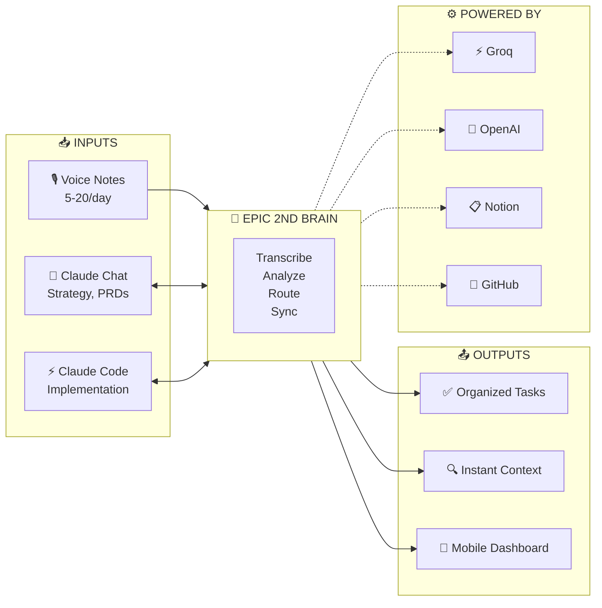

# System Context Diagram - Epic 2nd Brain
# Mermaid Source of Truth
# Last Updated: 2024-11-24

## Overview

This is the **executive view** - simplified for quick understanding.
For the visual HTML version, see: `visuals/system-overview.html`

## Diagram

## Key Metrics

| Metric | Value | Status |
|--------|-------|--------|
| Voice note success rate | 96% | ✅ Good |
| Context load time | 3 min (was 15 min) | ✅ Good |
| Time saved per week | 70-120 min | ✅ Good |

## Current Friction Points

1. **Claude Chat → Code Handoff**: Manual copy-paste, context loss (~5 min per handoff)
2. **Notion Sync Visibility**: No confirmation, can't select files for mobile
3. **Context Loading Opacity**: Can't see why files were selected, hard to adjust

## Related Diagrams

- [Container Architecture](./container-architecture.mermaid.md) - How pieces connect
- [Leverage Points](./leverage-points.mermaid.md) - Where to invest (TODO)
