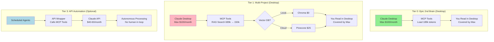

# Context Engineering for Epic 2nd Brain

**Status**: Research & Planning Phase  
**Owner**: Dharan Chandra Hasan  
**Last Updated**: November 18, 2025 (Architecture Clarified)  
**Purpose**: Deep-dive research on context management systems for AI-powered workflows

---

## ⚠️ Critical Updates

### **1. Multi-Project Reality: 820k Tokens (Not 189k)**
**Previous assumption**: ~189k tokens (Epic 2nd Brain only)  
**Actual reality**: **~820k tokens across all projects**  
**Implication**: You're 4.1x OVER the 200k threshold → RAG required in Tier 1

### **2. Desktop-First Architecture (Not API-Based)**
**Previous assumption**: Build API-based system with per-session charges  
**Actual reality**: **Claude Desktop + MCP (covered by Max $100/month)**  
**Implication**: No additional costs for Tier 0-2, API optional in Tier 3+

---

## What is Context Engineering?

Context engineering is the practice of optimizing how information is stored, retrieved, and presented to AI systems to maximize accuracy, speed, and cost-effectiveness. For your Epic 2nd Brain infrastructure, this determines:

- How quickly Claude can find relevant decisions from past work
- How accurately it retrieves the right information (vs hallucinating or missing key details)
- How much it costs to maintain context across multiple projects
- How well the system scales as your corpus grows

**The Core Problem**: You currently spend 10-15 minutes per session manually loading context (reading past chats, checking Notion, finding decisions). With 820k tokens across projects, you need smart retrieval (RAG), not just prompt caching. But you're using Claude Desktop (Max subscription), so costs stay minimal.

---

## Why This Matters for Your Workflow

**Current Friction Points**:
1. **Manual context loading**: 10-15 min per session = 70-120 min/week wasted
2. **"What did we decide?" moments**: 3-5 times/week losing track of decisions
3. **Copy-paste overhead**: 5-10 copy-paste events per session
4. **Documentation lag**: 1-3 days between work and Notion updates
5. **Multi-project context switching**: Can't load 820k tokens in 200k context window

**The Solution**: 
- **Tier 0-2 (Desktop)**: Claude Desktop + MCP tools (covered by Max $100/month)
- **Tier 3+ (API)**: Optional autonomous agents ($40-60/month additional)
- Anthropic's research: 49-67% better retrieval with hybrid RAG
- Your corpus requires: Simple caching (Tier 0) + RAG (Tier 1) + optional API (Tier 3)

**ROI Potential**:
- Time saved: 70-120 min/week = 5-10 hours/month
- Cost: $100-125/month (Tier 0-2 Desktop) or $165-185/month (Tier 3+ API)
- Value: $467-800/month (at $100/hr)
- ROI: 4-8x return (Desktop) or 3-6x return (with API)

---

## Token Reality Check

### **Your Actual Corpus (November 2025)**

```
Project              | Tokens  | Status
---------------------|---------|------------------------
Epic 2nd Brain       | 189k    | ✅ Fits in 200k (alone)
Legacy AI            | 500k    | 🚨 2.5x over threshold
Home Remodel         | 50k     | ✅ Fits in 200k (alone)
Baby Prep            | 30k     | ✅ Fits in 200k (alone)
Life Admin           | 50k     | ✅ Fits in 200k (alone)
---------------------|---------|------------------------
TOTAL (all projects) | 819k    | 🚨 4.1x over threshold
```

### **Architecture by Tier**

| Tier | Corpus | Approach | Interface | Cost |
|------|--------|----------|-----------|------|
| 0 | 189k | Prompt caching | Claude Desktop | $100/month |
| 1 | 689k | Hybrid RAG | Claude Desktop | $100-125/month |
| 2 | 820k | Multi-project RAG | Claude Desktop | $100-125/month |
| 3 | 820k | RAG + API agents | Desktop + API | $165-185/month |

**Key Insight**: Costs stay minimal (Tier 0-2) because you're using Claude Desktop (flat Max subscription), not API calls.

---

## Cost Reality (Corrected for Desktop Architecture)

### **Previous Estimate (WRONG)**
- Assumed API-based system
- Estimated $40-60/month for Tier 0 (per-session charges)
- Estimated $165+/month for Tier 1

### **Actual Costs (CORRECTED)**

```
Tier 0-2 (Claude Desktop):
├─ Claude Max: $100/month (flat fee, unlimited)
├─ MCP Server: $0/month (runs locally)
├─ BM25/Embeddings: $0/month (after $0.84 one-time setup)
├─ Vector DB: $0-25/month (Chroma local = free, Pinecone = $25)
└─ TOTAL: $100-125/month

Tier 3+ (Add API Automation):
├─ Claude Max: $100/month (keep for interactive work)
├─ Claude API: $40-60/month (NEW - autonomous agents)
├─ Vector DB: $25/month (same)
└─ TOTAL: $165-185/month
```

**Why So Much Lower?**
- Claude Desktop uses your Max subscription (flat fee)
- MCP loads files locally (no API calls)
- You read results in Desktop (covered by unlimited)
- Only Tier 3+ needs API (optional autonomous agents)

---

## When You'd Need API Access

### **Scenarios That REQUIRE API** (Tier 3+, Optional)

**1. Scheduled Reports**: "Every Monday 7am, summarize blockers"  
→ Agents run on schedule, without you

**2. Background Processing**: "Process voice notes every hour"  
→ Agents work while you're not at computer

**3. Event-Driven Actions**: "When interview uploaded, auto-analyze"  
→ Triggered by events, not by you

**4. Multi-Agent Orchestration**: "PRD → Tech Spec → Code → Review"  
→ Agents collaborate without you in the loop

**Cost**: $40-60/month additional  
**Trigger**: When manual work >2 hours/month (ROI justifies it)  
**Timeline**: Q2 2026 (after Tier 0-2 validated)

---

### **Scenarios That DON'T Need API** (Tier 0-2, Current Plan)

**1. Interactive Context Loading**: ✅ Claude Desktop
- You: "Start session for Legacy AI"
- MCP: Loads docs (local)
- You: Read in Desktop (Max covers this)

**2. Document Search**: ✅ Claude Desktop
- You: "What did we decide about X?"
- MCP: Searches via RAG (local)
- You: Review results (Max covers this)

**3. PRD Writing**: ✅ Claude Desktop
- You: "Write PRD for feature X"
- Claude: Drafts in Desktop
- You: Iterate, approve (Max covers this)

**Cost**: $0 additional (covered by Max subscription)

---

## Learning Path (Read in This Order)

### Phase 1: Understand the Fundamentals
**Start here if**: You want to understand how RAG systems work

📄 **[Fundamentals](./fundamentals.md)**
- Chunking, BM25, semantic embeddings
- Prompt caching economics
- 200k token threshold

**Time**: 20-30 minutes  
**Outcome**: Technical literacy for architecture decisions

---

### Phase 2: Learn from Anthropic's Research
**Start here if**: You want to see what research proves

📄 **[Anthropic Contextual Retrieval Insights](./anthropic-contextual-retrieval-insights.md)**
- Performance: 35% → 49% → 67% improvement
- Cost: $1.02/M tokens with caching
- Why contextualized embeddings win

**Time**: 15-20 minutes  
**Outcome**: Research-backed benchmarks

---

### Phase 3: Apply to Your System ⚠️ **UPDATED**
**Start here if**: You want specific Epic 2nd Brain recommendations

📄 **[Application to Epic 2nd Brain](./application-to-epic2b.md)** ← **JUST UPDATED**
- **CORRECTED**: 820k tokens (not 189k)
- **CLARIFIED**: Desktop-first (Tier 0-2), API optional (Tier 3+)
- Tier 0: Prompt caching ($100/month)
- Tier 1: Hybrid RAG ($100-125/month)
- Tier 3: Optional API automation ($165-185/month)
- When you'd actually need API access
- Future-proofing strategy (API-ready design)

**Time**: 30-40 minutes  
**Outcome**: Clear implementation plan for your actual architecture

---

### Phase 4: Make Decisions ⚠️ **Needs Update**
**Start here if**: You're ready to choose vendors

📄 **[Decision Framework](./decision-framework.md)** ← **Needs revision**
- Vendor comparison (OpenAI vs Gemini vs Voyage)
- Cost-benefit analysis
- Decision tree: Desktop vs API timing

**Time**: 15-20 minutes  
**Status**: Needs update to reflect Desktop-first architecture

---

### Phase 5: Execute ⚠️ **Needs Update**
**Start here if**: You're ready to implement

📄 **[Next Steps](./next-steps.md)** ← **Needs revision**
- PRD updates required
- Testing protocols
- Action items

**Time**: 10 minutes  
**Status**: Needs update for Tier 0-2 phasing

---

## Future Documentation (To Be Created)

📄 **[Testing Protocols](./testing-protocols.md)** - Validation for each tier  
📄 **[Migration Guides](./migration-guides.md)** - Desktop → API transition

---

## Key Concepts Quick Reference

| Term | Definition | Why It Matters |
|------|------------|----------------|
| **Claude Max** | $100/month flat-fee subscription | Covers all Desktop usage (no per-session charges) |
| **Claude API** | Pay-per-token programmatic access | Only needed for autonomous agents (Tier 3+) |
| **MCP Tools** | Local context loading | Works for Desktop AND API (future-proof) |
| **BM25** | Keyword-based matching | Finds exact terms, runs locally (free) |
| **Semantic Embeddings** | Meaning-based matching | Finds synonyms, one-time setup cost |
| **Contextual Embeddings** | Add context before embedding | 35% better accuracy |
| **Prompt Caching** | 90% cost savings on repeated context | Built into Claude API/Desktop |
| **200k Threshold** | Claude's context window | Below = simple, Above = need RAG |
| **RAG** | Retrieval-Augmented Generation | Smart search for large corpora |
| **Hybrid Approach** | BM25 + embeddings + caching | Best accuracy (67% improvement) |

---

## System Architecture Overview (Updated)



**Current State (Tier 0)**: Green (Desktop only)  
**Next State (Tier 1)**: Pink (Desktop + RAG)  
**Future State (Tier 3)**: Blue (Add API if needed)

---

## Related Documentation

- **[Context Sync Bridge PRD](../../prd/context-sync-bridge.md)** - Main project PRD (needs updates)
- **[Roadmap](../../context/roadmap.md)** - Current implementation status
- **[Systems Thinking Workbook](../../Systems_Thinking_Workbook__Energy___Voice-to-Notion.md)** - Leverage points

---

## Version History

| Date | Author | Changes |
|------|--------|---------|
| 2025-11-18 (AM) | Claude (Sonnet 4.5) | Initial research documentation |
| 2025-11-18 (PM v1) | Claude (Sonnet 4.5) | Corrected token counts (189k → 820k) |
| 2025-11-18 (PM v2) | Claude (Sonnet 4.5) | **Architecture clarified**: Desktop-first (Tier 0-2), API optional (Tier 3+), costs corrected to $100-125 |

---

## Next Actions

1. ✅ **Read Application to Epic 2nd Brain** (just updated with architecture clarity)
2. ⬜ **Update Context Sync Bridge PRD** (Phase 5 changes, add Tier 3 for API)
3. ⬜ **Implement Tier 0 prompt caching** (next Claude Code session, 1 hour)
4. ⬜ **Plan Tier 1 RAG** (for when adding Legacy AI, 6-8 hours)
5. ⬜ **Defer API to Tier 3** (optional, Q2 2026, if ROI justifies)

---

**Key Takeaway**: Your costs are WAY LOWER than I estimated. Tier 0-2 is just $100-125/month (Desktop-only), not $165+/month (API-based). API automation is optional (Tier 3+) and only makes sense when manual work exceeds 2 hours/month.

**Next**: Read **[Application to Epic 2nd Brain](./application-to-epic2b.md)** - it now clarifies the Desktop-first architecture and when you'd actually need API access.
