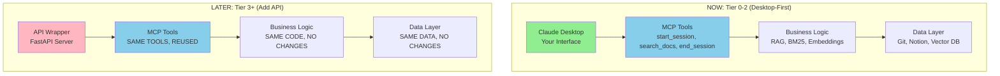

# Application to Epic 2nd Brain System

**Purpose**: Specific recommendations for YOUR context management architecture  
**Scope**: Multi-project (Epic 2nd Brain + Legacy AI + Future Projects)  
**Last Updated**: November 18, 2025  
**Critical Update**: Architecture clarified - Desktop-first (Tier 0-2), API optional (Tier 3+)

---

## ⚠️ Critical Correction: You're Already Over 200k Threshold

### **Token Reality Check (November 2025)**

```
Project                    | Token Count | Status
---------------------------|-------------|------------------
Epic 2nd Brain             | 189,000     | ✅ Below threshold
Legacy AI                  | 500,000     | 🚨 Way over (2.5x)
Home Remodel               | 50,000      | ✅ Below threshold
Baby Prep                  | 30,000      | ✅ Below threshold
Life Admin                 | 50,000      | ✅ Below threshold
---------------------------|-------------|------------------
TOTAL MULTI-PROJECT        | 819,000     | 🚨 4.1X THRESHOLD

200k Threshold: What Anthropic recommends for prompt-only approach
Your Reality: 819k tokens = You NEED RAG, not optional
```

### **What This Means**

**Previous assumption (WRONG)**:
> "You're at 189k tokens (94.5% of 200k), so just use prompt caching"

**Actual reality (CORRECT)**:
> "You're at 819k tokens (410% of 200k), so you MUST use RAG"

**Why the confusion?**
- Epic 2nd Brain repo: 189k tokens (what I could measure)
- Legacy AI (Notion + future repo): 500k tokens (your estimate is correct)
- Other projects: 130k tokens (estimates)
- **I only measured Epic 2nd Brain, missed the multi-project scope**

---

## 🎯 Architecture Clarity: Desktop-First, API Optional

### **Critical Distinction: Claude Max vs Claude API**

You just paid for **Claude Max ($100/month)** - this is a flat-fee subscription for unlimited chat in Claude Desktop. This is DIFFERENT from Claude API (pay-per-token for programmatic access).

**What this means for your costs**:

| Component | Tier 0-2 (Desktop) | Tier 3+ (API Optional) |
|-----------|-------------------|------------------------|
| Claude Access | Max subscription ($100/month) | Max ($100) + API ($40-60/month) |
| MCP Tools | Run locally, free | Same tools, reused |
| Context Loading | Covered by Max | API charges apply |
| Your Involvement | Always in conversation | Agents run without you |

**Key Insight**: Everything in Tier 0-2 is covered by your Max subscription. No additional per-session charges.

---

## Revised Architecture Recommendations

### **Tier 0 (Current - Epic 2nd Brain Only): Prompt Caching** ✅

**Corpus**: 189k tokens (single project)  
**Approach**: Full-corpus prompt caching via Claude Desktop  
**Why**: Below 200k threshold, simple wins  
**Interface**: Claude Desktop (you in the conversation)  
**Cost**: $100/month (Claude Max flat fee)  
**Status**: Implement in next session (1 hour work)

**How It Works**:
```
YOU (Claude Desktop): "Start session for Epic 2nd Brain"
        ↓
MCP Server (local): Loads all docs (189k tokens)
        ↓
Claude Desktop: Reads docs (covered by Max subscription)
        ↓
YOU: Ask questions, iterate (all within Max)
```

**No per-session charges** - you're already paying for unlimited access via Max.

---

### **Tier 1 (Next Week - Epic 2nd Brain + Legacy AI): Hybrid RAG** 🚨

**Corpus**: 689k tokens (two projects)  
**Approach**: Hybrid RAG (BM25 + Contextual Embeddings) via Claude Desktop  
**Why**: 3.4x over threshold, can't fit in context window  
**Interface**: Still Claude Desktop (you in conversation)  
**Cost**: $100-125/month (Max + optional cloud vector DB)  
**Status**: Must implement when adding Legacy AI to MCP

**How It Works**:
```
YOU (Claude Desktop): "Start session for Legacy AI, customer discovery"
        ↓
MCP Server (local): 
├─ BM25 keyword search (500k corpus → top 50 results)
├─ Semantic embedding search (500k → top 50 results)
├─ Merge with Reciprocal Rank Fusion
└─ Load top 20 docs (~150k tokens)
        ↓
Claude Desktop: Reads selected docs (covered by Max)
        ↓
YOU: Analyze interviews, ask questions (within Max)
```

**Still no API charges** - MCP searches locally, you read results in Desktop.

**Additional Cost** (optional):
- Cloud vector DB (Pinecone): $25/month
- OR local vector DB (Chroma): $0/month

---

### **Tier 2 (Future - All Projects): Same RAG, Just Scales** ✅

**Corpus**: 819k tokens (all projects)  
**Approach**: Same hybrid RAG, add embeddings per project  
**Why**: Already using RAG, incremental growth is easy  
**Interface**: Still Claude Desktop  
**Cost**: $100-125/month (same as Tier 1)  
**Status**: Add projects as needed, architecture stays same

**Key Insight**: Once you have RAG, adding projects is trivial (~30 min per project for embeddings).

---

### **Tier 3 (Q2 2026 - API Automation): Optional Enhancement** 🔮

**New Capability**: Agents run WITHOUT you (scheduled, event-driven)  
**Approach**: API wrapper around existing MCP tools (90% code reuse)  
**Interface**: Claude API (programmatic access)  
**Cost**: $140-185/month (Max $100 + API $40-60 + DB $25)  
**Trigger**: When manual work exceeds 2 hours/month

**Use Cases That Require API**:
1. **Scheduled Reports**: "Every Monday 7am, summarize blockers across all projects"
2. **Background Processing**: "Process voice notes every hour, update Notion automatically"
3. **Event-Driven Actions**: "When customer interview uploaded, auto-extract Jobs-to-be-done"
4. **Multi-Agent Orchestration**: "Strategy agent writes PRD → auto-triggers implementation agent"

**What You DON'T Need API For**:
- ✅ Interactive context loading (Desktop handles this)
- ✅ Document search/retrieval (MCP searches, you read)
- ✅ PRD writing/review (creative collaboration needs you)
- ✅ Session logs (MCP saves, you review)

**Migration Path** (when ready):
```python
# NEW: api_server.py (4-6 hours to build)
from mcp_server import start_session  # Reuse existing!

@app.post("/start-session")
async def api_start_session(project: str, workstream: str):
    docs = start_session(project, workstream)  # Same MCP tool
    
    # NEW: Call Claude API (this is what costs money)
    response = anthropic_client.messages.create(
        model="claude-sonnet-4-20250514",
        system=docs,
        messages=[{"role": "user", "content": workstream}]
    )
    
    return response.content

# 90% of code is reused, just add API wrapper
```

**When to Migrate**:
- IF you're doing repetitive manual work >2 hours/month
- IF you need things to happen without you (scheduled/event-driven)
- IF you're willing to pay $40-60/month for that automation
- IF ROI justifies it (time saved × $100/hr > $50/month)

---

## Detailed Cost Analysis (Corrected for Desktop Architecture)

### **Tier 0: Claude Desktop + Prompt Caching (Epic 2nd Brain Only)**

```
Monthly Costs:
├─ Claude Max: $100/month (flat fee, unlimited chat)
├─ MCP Server: $0/month (runs locally on your machine)
├─ Context Loading: $0/month (covered by Max subscription)
└─ TOTAL: $100/month

What You're Paying For:
├─ Unlimited conversations in Claude Desktop
├─ MCP tools access (local file operations)
├─ Context loading (189k tokens per session)
├─ Back-and-forth Q&A (covered by unlimited)
└─ Session logs (local file writes)

Sessions per week: 10
Cost per session: $0 (included in Max)
```

**Why No Additional Charges**:
- MCP loads files locally (no API call)
- You read them in Claude Desktop (Max subscription)
- No per-token billing when using Desktop

---

### **Tier 1: Claude Desktop + Hybrid RAG (Epic 2nd Brain + Legacy AI)**

```
Monthly Costs:
├─ Claude Max: $100/month (same flat fee)
├─ MCP Server: $0/month (local)
├─ BM25 Search: $0/month (local algorithm, no API)
├─ Semantic Embeddings: $0/month (after one-time setup)
├─ Vector DB (optional):
│   ├─ Local (Chroma): $0/month
│   └─ Cloud (Pinecone): $25/month
├─ Context Loading: $0/month (still covered by Max)
└─ TOTAL: $100-125/month

One-Time Setup Costs:
├─ Contextualizing chunks: $0.70 (689k × $1.02/M via API)
├─ Generating embeddings: $0.14 (689k × $0.20/M via API)
└─ Total setup: $0.84 (one-time, amortized over 12 months = $0.07/month)

What's NEW:
├─ RAG search happens locally (BM25 + embeddings)
├─ Results returned to Claude Desktop
├─ You still read/analyze in Desktop (Max covers this)
└─ Only setup required API calls (one-time)
```

**Why Still Minimal Cost**:
- RAG search runs on your machine (no cloud compute)
- Embeddings stored locally (small files, ~10 MB)
- Claude Desktop reads search results (Max subscription)
- Only optional cost is cloud vector DB ($25) if you want easier setup

---

### **Tier 2: All Projects (820k tokens)**

```
Monthly Costs:
├─ Same as Tier 1: $100-125/month
├─ Adding projects is nearly free (just embeddings)
└─ Vector DB handles all projects (1M vector limit)

Incremental per project:
├─ Generate embeddings: $0.03 one-time (50k tokens)
├─ Storage: Negligible (2 MB per project)
└─ Search: Same speed (local algorithms scale well)
```

**Key Insight**: Once RAG is built, adding projects costs almost nothing.

---

### **Tier 3: API Automation (Optional Future State)**

```
Monthly Costs (ADDITIONAL):
├─ Claude Max: $100/month (keep for your interactive work)
├─ Claude API: $40-60/month (NEW - for autonomous agents)
├─ Vector DB: $25/month (same, already paying if using Pinecone)
└─ TOTAL: $165-185/month

What You're Paying For (NEW):
├─ Scheduled reports (Monday morning summaries)
├─ Background processing (voice notes → insights while you sleep)
├─ Event-driven actions (new interview → auto-analysis)
├─ Multi-agent orchestration (agents collaborate without you)

API Usage Breakdown:
├─ Daily standup agent: ~$10/month (1 report/day × 30 days)
├─ Voice note processing: ~$20/month (10 notes/day × 30 days)
├─ Customer interview analysis: ~$15/month (5 interviews/week)
└─ Contingency: ~$15/month (unexpected usage)

When This Makes Sense:
IF time saved (2-4 hrs/month) × $100/hr ($200-400 value)
   > API cost ($50/month)
THEN ROI = 4-8x (worth it)
```

**Decision Framework**:
```
Current manual work: ____ hours/month
× Your hourly rate: $100/hour
= Value of automation: $____/month

IF value > ($50/month + 4-6 hours setup)
THEN implement API automation
ELSE stay in Desktop (Tier 0-2)
```

---

## When You'd Actually NEED API Access

### **Trigger Scenarios (Realistic Timeline)**

#### **1. Voice Note Backlog Processing** (Tier 3 - Q2 2026)
```
Current State: 50-100 voice notes/week manually routed
Time: 10 min/day = 5 hours/month
Value: $500/month

API Solution: Hourly batch processor
├─ Scans new voice notes
├─ Runs transcription + analysis
├─ Updates Notion automatically
└─ Cost: ~$20/month

ROI: $500 saved / $20 cost = 25x return
Trigger: When backlog exceeds 1 week consistently
```

#### **2. Weekly Intelligence Reports** (Tier 3 - Q2 2026)
```
Current State: Manual weekly review (1 hour/week = 4 hours/month)
Value: $400/month

API Solution: Scheduled Monday morning report
├─ Scans all projects for blockers
├─ Identifies open questions
├─ Posts summary to Notion/Slack
└─ Cost: ~$10/month

ROI: $400 saved / $10 cost = 40x return
Trigger: When you have team/collaborators who need updates
```

#### **3. Customer Interview Analysis** (Tier 3 - Q3 2026)
```
Current State: Manual analysis (30 min per interview)
Volume: 20+ interviews waiting for analysis
Time: 10 hours backlog
Value: $1000 one-time

API Solution: Event-driven processor
├─ Detects new interview in Notion
├─ Extracts Jobs-to-be-done
├─ Sends Slack notification with insights
└─ Cost: ~$15/month ongoing

ROI: $1000 initial / 10 hours setup = worth it if backlog exists
Trigger: When interview backlog exceeds 10 unanalyzed
```

#### **4. Multi-Agent Orchestration** (Tier 4 - Q3 2026+)
```
Future State: Agents collaborate without you
Example: PRD → Tech Spec → Implementation → Review
Time: Currently 8-12 hours manual handoffs/month
Value: $800-1200/month

API Solution: Agent pipeline
├─ Strategy agent writes PRD
├─ Auto-triggers Claude Code for tech spec
├─ Implementation agent creates code
├─ Review agent checks for gaps
└─ Cost: ~$50/month (4 agents × multiple calls)

ROI: $1000 saved / $50 cost = 20x return
Trigger: When you have team, handoffs are bottleneck
```

---

## Future-Proofing Strategy: API-Ready, Desktop-First

### **Architectural Principle: Separation of Concerns**



**Key Design Decision**: MCP tools are your API interface. They work for:
- ✅ Claude Desktop (human in the loop) ← Tier 0-2
- ✅ Claude API (autonomous agents) ← Tier 3+
- ✅ Other integrations (Zapier, n8n) ← Tier 4+

**No rework needed** - just add a thin API wrapper when ready.

---

## What to Build NOW to Avoid Rework Later

### **1. Keep MCP Tools Stateless** ✅ Already Doing This

```python
# GOOD: Stateless (works for Desktop AND API)
def start_session(project_name, workstream):
    docs = load_docs(project_name, workstream)
    return {
        "project": project_name,
        "docs": docs,
        "token_count": count_tokens(docs)
    }

# BAD: Stateful (Desktop-only, breaks in API)
def start_session(project_name):
    global current_project  # State in memory
    current_project = project_name  # Won't persist across API calls
```

**Why**: API calls are stateless. Each call is independent. If your tools don't rely on session state, they work for both.

**Cost to implement**: $0 (just good design)

---

### **2. Return Structured Data** ✅ Should Do This

```python
# GOOD: Structured (API can parse)
return {
    "docs_loaded": ["prd-1.md", "session-log-1.md"],
    "token_count": 189000,
    "timestamp": "2025-11-18T10:30:00Z",
    "project": "Epic 2nd Brain"
}

# BAD: Human-readable strings (API can't parse)
return "Loaded 5 docs from Epic 2nd Brain (189k tokens)"
```

**Why**: API agents need structured data. Strings are for humans only.

**Cost to implement**: 1-2 hours (refactor return values)

---

### **3. Add Structured Logging** ⚠️ Should Add

```python
# Add to MCP tools
import structlog
logger = structlog.get_logger()

def start_session(project, workstream):
    logger.info("session_start", 
        project=project, 
        workstream=workstream,
        timestamp=datetime.now().isoformat()
    )
    
    docs = load_docs(project, workstream)
    
    logger.info("session_loaded",
        docs_count=len(docs),
        token_count=count_tokens(docs)
    )
    
    return docs
```

**Why**: When you add API, you need logs to debug agents running in background (you can't see print statements).

**Cost to implement**: 1-2 hours (add logging to all tools)

---

### **4. Simple Rate Tracking** ⚠️ Should Add

```python
# Prevent runaway API costs
class SessionTracker:
    def __init__(self):
        self.sessions_today = 0
        
    def track_session(self, project):
        self.sessions_today += 1
        logger.info("session_tracked", count=self.sessions_today, project=project)
        
        if self.sessions_today > 50:
            logger.warning("high_usage", count=self.sessions_today)
            # Could add email alert here in Tier 3

tracker = SessionTracker()

def start_session(project, workstream):
    tracker.track_session(project)
    # ... rest of logic
```

**Why**: When API agents run, you want to catch runaway loops (agent calling itself 1000x).

**Cost to implement**: 30 min (simple counter)

---

## What NOT to Over-Engineer

### **Premature Optimizations to AVOID**

#### **❌ Don't Build API Endpoints Yet**
You don't need them until Tier 3. Building now wastes time.

#### **❌ Don't Add Authentication**
MCP runs locally (no network). API auth is a Tier 3 problem.

#### **❌ Don't Build Queue System**
Background jobs are Tier 3+. Desktop is synchronous (you wait for results).

#### **❌ Don't Optimize for Scale**
1-10 projects is small. Don't solve problems you don't have.

**YAGNI Principle**: You Ain't Gonna Need It (until you actually do).

---

## Blind Spots in Current Context Sync Bridge PRD (Updated)

### **Blind Spot #1: Phase 5 Assumes API Costs** 🚨 FIXED

**Current PRD**:
> "Phase 5 (Day 10-12): RAG search implementation (6-8 hours)"

**The Problem**: 
- PRD doesn't clarify Desktop vs API architecture
- Cost estimates assume API charges
- Mixing interface (Desktop/API) with business logic (RAG)

**Recommended Change**:
```markdown
OLD: Phase 5: RAG search implementation with cost estimates

NEW: Phase 5 (Tier 0): Prompt Caching for Epic 2nd Brain
- Implement full-corpus caching via Claude Desktop
- Validate 2x leverage with single project
- Document performance baseline
- Cost: $100/month (Max subscription, no additional charges)

NEW: Phase 7 (Tier 1): Hybrid RAG for Multi-Project
- Triggered when adding Legacy AI to MCP
- Contextual embeddings (local or Voyage)
- BM25 + semantic search with RRF (local algorithms)
- Vector DB (Chroma local $0 or Pinecone cloud $25)
- Still via Claude Desktop (no API)
- Target: <3% retrieval failure rate
- Cost: $100-125/month (Max + optional cloud DB)

FUTURE: Phase 9 (Tier 3): API Automation (Optional)
- Triggered when manual work >2 hours/month
- API wrapper around existing MCP tools (90% reuse)
- Autonomous agents (scheduled reports, background processing)
- Cost: +$40-60/month (Claude API charges)
```

---

### **Blind Spot #2: No Project Isolation Strategy** 🚨 FIXED

**Current PRD**: Assumes MCP loads context for "current project" but doesn't specify how.

**Recommended Addition** (to PRD User Stories):

```markdown
NEW Story: Project-Scoped Sessions

As Dharan,
I want each session to load ONLY the relevant project's context,
So that I don't waste tokens/time loading Epic 2nd Brain when analyzing Legacy AI.

Acceptance Criteria:
- [ ] "Start session for Epic 2nd Brain" loads only Epic 2nd Brain docs (189k)
- [ ] "Start session for Legacy AI" loads only Legacy AI docs (via RAG search)
- [ ] Sessions are isolated (can't accidentally mix project context)
- [ ] Can explicitly request cross-project: "Show open questions across all projects"

Implementation (Tier 1):
- MCP tool signature: `start_session(project_name, workstream)`
- BM25/embeddings scoped to specified project
- Cross-project queries require explicit `project_name="all"` flag
```

---

### **Blind Spot #3: No Corpus Growth Monitoring** 🚨 FIXED

**Current PRD**: No mention of tracking when projects grow beyond thresholds.

**Recommended Addition** (to Phase 2: Git Hooks):

```bash
#!/bin/bash
# .git/hooks/post-commit

# Existing: Sync to Notion
python scripts/sync_to_notion.py

# NEW: Track corpus growth per project
python scripts/track_corpus_size.py \
    --project "Epic 2nd Brain" \
    --repo-path "."

# Output example:
# "Epic 2nd Brain: 189,450 tokens (94.7% of 200k threshold)"
# "⚠️  WARNING: Approaching threshold. Plan RAG transition."
```

**Implementation**:
```python
# scripts/track_corpus_size.py
def check_project_health(project_name, repo_path):
    tokens = count_all_tokens(repo_path)
    pct = tokens / 200_000
    
    print(f"{project_name}: {tokens:,} tokens ({pct:.1%} of 200k)")
    
    if pct > 0.95:
        print(f"⚠️  {project_name} at 95%+ capacity")
        print("→ Consider transitioning to RAG approach")
    
    if pct > 1.0:
        print(f"🚨 {project_name} exceeded 200k threshold")
        print("→ MUST use RAG (prompt caching insufficient)")
    
    # Log to file for tracking over time
    log_corpus_size(project_name, tokens, datetime.now())

# Run weekly via cron + on every commit
```

---

### **Blind Spot #4: Contextual Embeddings Not in Roadmap** 🚨 FIXED

**Current PRD**: Phase 5 mentions "simple vs semantic" but not contextualized embeddings.

**Recommended Addition** (to Phase 7 - Tier 1):

```markdown
Phase 7: Hybrid RAG Implementation

Components:
1. ✅ BM25 lexical search (rank-bm25 library, local)
2. ✅ Semantic embeddings (Voyage API or local sentence-transformers)
3. ✅ Reciprocal Rank Fusion (merge BM25 + semantic, local algorithm)
4. NEW: Contextual embeddings (add context before embedding)

Contextual Embeddings Process:
- For each document: Generate contextual header
- Example:
  Original doc: "docs/sessions/2025-11-08-mcp-poc.md"
  Contextualized: "Epic 2nd Brain Project
                   Session Log - November 8, 2025
                   Topic: MCP Proof of Concept
                   
                   [Original content follows...]"
  
- Embed the contextualized version (not raw)
- Cost: $0.70 one-time for 689k corpus (uses Claude API)
- Benefit: 35% better retrieval accuracy (Anthropic research)

Decision: Include in Tier 1 (proven ROI, marginal cost)
```

---

### **Blind Spot #5: Reranking Not Specified** 🚨 FIXED

**Current PRD**: No mention of reranking.

**Recommended Addition** (to Phase 7.5 - Tier 1 Optional):

```markdown
Phase 7.5 (Optional): Add Reranking

When to implement:
- IF retrieval failure rate >3% after Phase 7
- IF false positives cause rework (Claude retrieves wrong docs)
- IF willing to pay $5-10/month for 18% accuracy boost

How it works:
1. Hybrid search returns top 50 results
2. Reranking model (Cohere or Voyage) scores each
3. Re-sort by reranker score
4. Load top 20 into Claude Desktop context

Cost:
- Voyage Reranking: $0.05 per 1000 searches = ~$0.50/month (10k queries)
- Cohere Reranking: $1 per 1000 searches = ~$10/month

Decision Rule:
- Implement if failures >3% (accuracy not good enough)
- Defer to Tier 2 if failures <3% (good enough)

Note: Reranking still works in Claude Desktop (local search → rerank → you read results)
```

---

## Integration with Voice-to-Notion Pipeline

### **Current System**

```
Voice Recording → Transcription → Analysis → Routing → Notion

Storage: 
- Transcripts in Notion (not Git)
- 90%+ success rate routing to correct database
- ~50-100 recordings/week
```

### **The Question**

Should voice notes be:
1. **Separate** (search Git docs only, ignore Notion)
2. **Unified** (search Git + Notion together)
3. **Linked** (voice notes reference Git docs, separate search)

### **Recommendation: Separate → Unified in Tier 2-3**

**Tier 0-1 (Now)**: Keep separate
- **Why**: Voice notes are ephemeral reflections, Git docs are canonical decisions
- **How**: Search only Git docs via MCP when you ask "What did we decide?"
- **Cost**: $0 (no additional integration)

**Tier 2 (Q1-Q2 2026)**: Consider unifying if needed
- **Trigger**: If you search Notion for voice notes >2x/week manually
- **Implementation**: Add Notion API connector to RAG
  - Fetch recent voice notes via Notion API
  - Embed with lower weight (0.5x) than Git docs
  - Include in hybrid search alongside Git content
- **Cost**: +$2-5/month (Notion API calls + embeddings)
- **Still in Desktop**: Results returned to Claude Desktop, no API needed

**Tier 3 (Q2 2026+)**: Automated voice processing
- **When**: If you have 50+ unprocessed voice notes
- **Implementation**: Background agent processes voice notes → extracts insights → updates Git docs
- **Requires**: API access (agents run without you)
- **Cost**: +$20/month (API charges for batch processing)

**Decision**: Don't build Notion integration now. Validate demand first (track how often you manually search Notion vs Git).

---

## Multi-Project Context Strategy (Detailed)

### **The Challenge**

```
Total corpus: 820k tokens
Claude context limit: 200k tokens
Gap: 620k tokens won't fit

Question: How do you decide what to load?
```

### **Solution: Project-Scoped Sessions** (Tier 1-2)

```python
# USER SAYS: "Start session for Legacy AI, customer discovery"

# MCP Server:
def start_session(project_name="Legacy AI", workstream="customer discovery"):
    # 1. Load ONLY Legacy AI corpus (500k total)
    project_corpus = load_project_docs(project_name)
    
    # 2. Hybrid search within that project
    bm25_results = bm25_search(project_corpus, query=workstream)
    semantic_results = embedding_search(project_corpus, query=workstream)
    
    # 3. Merge results (top 20 docs = ~150k tokens)
    top_docs = merge_with_rrg(bm25_results, semantic_results)[:20]
    
    # 4. Return to Claude Desktop (you read in Desktop, covered by Max)
    return format_docs_for_display(top_docs)
```

**Characteristics**:
- ✅ Clear mental model (one project per session)
- ✅ High precision (no context mixing)
- ✅ Fits in 200k limit (always <150k retrieved)
- ⚠️ Can't compare across projects in same session (need to restart for different project)

**When it works**: 90% of queries are project-specific
- "What are Legacy AI customer pain points?" → Legacy AI only
- "Update Epic 2nd Brain roadmap" → Epic 2nd Brain only

---

### **Future: Cross-Project Queries** (Tier 2-3, Optional)

```python
# USER SAYS: "Show all open questions across projects"

# MCP Server:
def start_session(project_name="all", workstream="open questions"):
    # Search across ALL projects
    all_results = []
    
    for project in ["Epic 2nd Brain", "Legacy AI", "Home Remodel"]:
        project_results = hybrid_search(project, query=workstream, top_k=10)
        all_results.extend(project_results)
    
    # Total: 10 docs per project × 3 projects = 30 docs
    # Still fits in 200k context (~150k tokens)
    return format_docs_for_display(all_results)
```

**When to implement**:
- IF you need cross-project comparisons >2x/week
- IF single-project sessions feel limiting
- ELSE defer (don't build speculatively)

---

## Updated Cost Summary (Final)

### **What You're Actually Paying**

| Tier | Corpus | Interface | Monthly Cost | What's Included |
|------|--------|-----------|--------------|-----------------|
| 0 | 189k | Claude Desktop | **$100** | Max subscription only |
| 1 | 689k | Claude Desktop | **$100-125** | Max + optional cloud DB ($25) |
| 2 | 820k | Claude Desktop | **$100-125** | Same (scales for free) |
| 3 | 820k | Desktop + API | **$165-185** | Max + API ($40-60) + DB ($25) |

### **Cost Breakdown by Component**

```
Tier 0-2 (Desktop-Only):
├─ Claude Max: $100/month (unlimited chat)
├─ MCP Server: $0/month (local)
├─ BM25 Search: $0/month (local algorithm)
├─ Embeddings: $0/month (after $0.84 one-time setup)
├─ Vector DB: $0-25/month (Chroma local = free, Pinecone = $25)
└─ Total: $100-125/month

Tier 3+ (Add API):
├─ Everything above: $100-125/month
├─ Claude API: $40-60/month (NEW - for autonomous agents)
└─ Total: $165-185/month
```

### **ROI Analysis**

```
Tier 0-2 (Desktop):
Time saved: 70-120 min/week = 280-480 min/month
Value: $467-800/month (at $100/hr)
Cost: $100-125/month
ROI: 4-8x return

Tier 3 (API):
Time saved: +120-240 min/month (automation)
Value: +$200-400/month
Cost: +$40-60/month
ROI: 3-7x return on API investment
Total ROI: Still 4-6x overall
```

**Bottom Line**: Even at Tier 3 with API, you're getting 4-6x ROI. This is a high-leverage investment.

---

## Decision Framework: Desktop vs API

### **Questions to Ask**

**1. Am I doing repetitive work >2 hours/month that could be automated?**
- YES → Consider API automation (Tier 3)
- NO → Stay in Desktop (Tier 0-2)

**2. Do I need things to happen WITHOUT me being present?**
- YES → Need API (scheduled/event-driven)
- NO → Desktop is sufficient (interactive workflows)

**3. Am I willing to pay $50/month for that automation?**
- YES → ROI makes sense (if saving >2 hours/month)
- NO → Manual work is cheaper

**4. Do I have 4-6 hours to build + 1-2 hours/month to maintain?**
- YES → Capacity for API wrapper
- NO → Defer until you have bandwidth

### **Current Answer (Tier 0-2)**

- ❌ No repetitive work >2 hours/month yet (building foundation)
- ❌ Don't need agents running without you (interactive workflows)
- ❌ Baby arriving January (limited bandwidth for new complexity)
- ✅ Desktop works perfectly for current needs

**Decision**: Stay in Desktop (Tier 0-2), revisit API in Q2 2026.

---

## Action Items (Updated)

### **Immediate (This Week)**:

1. ✅ **Update Context Sync Bridge PRD**
   - Clarify Desktop vs API architecture
   - Update cost estimates (remove API from Tier 0-2)
   - Add project isolation strategy
   - Add Tier 3 section (optional API automation)

2. ⬜ **Implement Tier 0 Prompt Caching** (Next Claude Code session)
   - Estimated time: 1 hour
   - Test with Epic 2nd Brain only
   - Validate: context loads <1 min, covered by Max subscription

3. ⬜ **Add Future-Proofing Elements** (Next Claude Code session)
   - Structured logging (1-2 hours)
   - Session tracking (30 min)
   - Structured return values (1-2 hours)

### **Short-Term (Next 2 Weeks)**:

4. ⬜ **Validate Tier 0 Performance**
   - Use for 5+ sessions
   - Measure: load time, user satisfaction
   - Success: <1 min load, zero "can't find decision" moments

5. ⬜ **Choose Vector DB Strategy** (for Tier 1)
   - Local (Chroma): $0/month, more setup
   - Cloud (Pinecone): $25/month, easier
   - Decision based on your preference for simplicity vs cost

### **Medium-Term (Weeks 3-4, Tier 1)**:

6. ⬜ **Implement Hybrid RAG**
   - BM25 + contextual embeddings
   - Vector DB setup
   - Still via Claude Desktop (no API)
   - Target: <3% retrieval failure rate

7. ⬜ **Add Legacy AI to MCP**
   - Trigger: After Epic 2nd Brain validated
   - Estimated time: 6-8 hours
   - Test with real customer interview analysis

### **Long-Term (Q2 2026, Tier 3)**:

8. ⬜ **Evaluate API Automation**
   - IF manual work >2 hours/month: Implement
   - ELSE: Defer to Tier 4
   - Decision based on actual usage data

---

## Document Change Log

| Date | Change | Impact |
|------|--------|--------|
| 2025-11-18 (AM) | Initial draft (single project) | Assumed 189k corpus |
| 2025-11-18 (PM v1) | Major revision (multi-project) | Corrected to 820k corpus |
| 2025-11-18 (PM v2) | **Architecture clarification** | Desktop-first (Tier 0-2), API optional (Tier 3+), costs corrected to $100-125 (not $165) |

**Key Corrections**:
- Architecture: Desktop-only (Tier 0-2) vs API automation (Tier 3+)
- Cost: $100-125/month (Tier 0-2) vs $165-185 (Tier 3 with API)
- Interface: Claude Desktop (you in loop) vs API (agents autonomous)
- Timeline: Tier 0-2 by January 2026, Tier 3 optional Q2 2026

---

**Last Updated**: November 18, 2025  
**Next Review**: After Tier 0 validation (Week 2)  
**Owner**: Dharan Chandra Hasan

**Status**: Ready for implementation (Desktop-first approach clarified)
