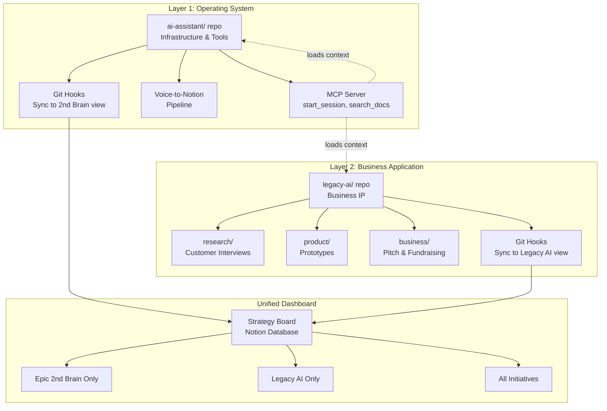

# PRD: Multi-Project Expansion - Context Sync Bridge Goes Multi-Repo

**Status**: Draft → Approved (pending review)
**Owner**: Dharan Chandra Hasan
**Created**: 2025-11-11
**Last Updated**: 2025-11-11
**Parent Initiative**: [Multi-Project Expansion](https://www.notion.so/2a68369c730581b5afc0fd2bb1486e39)
**Notion Strategy Board**: Epic 2nd Brain - Strategy Board (Hybrid/Filtered)
**Tech Requirements**: [To be created by Claude Code in Session 2B]

---

## 🎯 TL;DR

Expand the Context Sync Bridge from single-project (Epic 2nd Brain infrastructure) to **multi-repo architecture** supporting business projects (Legacy AI) alongside personal infrastructure - enabling you to run customer discovery sessions with the same automated context loading that saved 70-120 min/week on infrastructure work, while maintaining clean IP separation for co-founder onboarding and investor due diligence.

**Time Investment**: 6-8 hours (Session 2B implementation)
**Unlocks**: Professional repo structure for Legacy AI business, co-founder-ready collaboration, investor-grade documentation hygiene

---

## 🎯 Problem Statement

**The Gap:**

Context Sync Bridge works beautifully for Epic 2nd Brain (your personal operating system), but Legacy AI (your business) lives in Notion with 30+ documents across customer interviews, requirements, technical feasibility, and positioning strategy. You're about to:
- Conduct 5+ customer interviews next week
- Start prototype validation work
- Onboard Peter as co-founder (your systems thinking coach)
- Begin fundraising prep (pitch deck, investor conversations)

**Current Pain:**
- Business IP mixed with personal infrastructure in single repo concept
- No automated context loading for Legacy AI sessions
- Customer discovery workflow is manual (transcribe → manual template fill → Notion)
- When Peter joins, unclear what he gets access to (personal infrastructure vs business)
- No professional repo structure for investor due diligence

**Why This Matters:**
Legacy AI isn't a "project" - it's your **business**. The one you're betting your life on. The one that will support your family. It deserves:
- Professional version control (decision history matters for investors)
- Clean IP separation (Peter gets business access, not your personal system)
- Automated workflows (your time is about to get MUCH more scarce with baby arriving)
- Systems thinking rigor (customer insights → prototypes → pitch deck needs structure)

**The Conceptual Breakthrough:**

```
WRONG MODEL (Current):
ai-assistant/
└── docs/
    ├── epic-2nd-brain/    # Infrastructure project
    └── legacy-ai/         # Business project (DOESN'T BELONG HERE)

RIGHT MODEL (Target):
1. Projects/
   └── ai-assistant/       # Operating system (infrastructure)
   
2. Projects/  
   └── legacy-ai/          # Business (application running ON the OS)
```

**Analogy:**
- You wouldn't put your company's business plan inside your text editor's source code
- Epic 2nd Brain = Your custom IDE
- Legacy AI = The software company you're building WITH that IDE

---

## 🔧 High-Level Approach

### **Strategy: Two-Repo Architecture with Unified Dashboard**

**Layer 1: Infrastructure (ai-assistant/)**
```
ai-assistant/
├── mcp_server/              # Tools that work for ANY project
│   ├── __init__.py
│   └── server.py            # start_session(), search_docs(), etc.
├── src/                     # Voice-to-Notion pipeline
├── scripts/
│   └── sync_to_notion.py    # Git hooks (project-aware)
├── docs/
│   ├── infrastructure/      # Meta-learnings about YOUR system
│   │   ├── workflows/
│   │   ├── templates/
│   │   └── systems-thinking/
│   └── meta-projects/       # Projects ABOUT the infrastructure
│       └── context-sync-bridge/
└── .git/hooks/
    └── post-commit          # Syncs to "Epic 2nd Brain" filtered view
```

**Layer 2: Business Projects (legacy-ai/)**
```
legacy-ai/
├── research/                # Customer discovery
│   ├── customer-interviews/
│   │   ├── transcripts/     # Raw interview data
│   │   ├── analyses/        # Jobs-to-be-done breakdowns
│   │   └── insights/        # Cross-interview patterns
│   ├── requirements-vision.md
│   ├── positioning.md
│   └── technical-feasibility/
├── product/                 # Post-discovery
│   ├── prototypes/
│   │   ├── validation-questions.md
│   │   ├── figma-links.md
│   │   └── systems-diagrams/  # Mermaid before Figma
│   ├── prd/                 # Future: After prototype validation
│   └── design/              # Future: After prototype decisions
├── business/                # Go-to-market
│   ├── pitch-deck/
│   ├── fundraising-strategy/
│   └── go-to-market/
├── sessions/                # Session logs
│   ├── customer-discovery/
│   ├── prototype-iteration/
│   └── funding-prep/
├── docs/
│   ├── decision-log.md      # Key pivots (Uncle Bob insights, etc.)
│   ├── roadmap.md
│   └── templates/
│       ├── customer-interview-analysis.md
│       └── prototype-validation.md
└── .git/hooks/
    └── post-commit          # Syncs to "Legacy AI" filtered view
```

**Notion Integration: Unified Strategy Board with Filtered Views**
```
Strategy Board Database (Unified)
├── Property: "Project" [Epic 2nd Brain, Legacy AI, Life Admin, Multiple]
├── Property: "Work Stream" [research, product, business, infrastructure]
├── Property: "Status", "Priority Score", etc. (existing)
│
Views:
├── "All Initiatives" (default - YOU see this in morning ritual)
├── "Legacy AI Only" (shareable with Peter)
├── "Epic 2nd Brain Only" (private - your infrastructure work)
└── "Active This Week" (filtered by date + status)
```

**Why This Works:**

1. **Clean IP Separation**: When investors ask "show me your repo", you share `legacy-ai/` (business), not `ai-assistant/` (personal system)

2. **Co-founder Ready**: Peter gets access to `legacy-ai/` GitHub org, sees full decision history, never sees your personal infrastructure

3. **Professional Hygiene**: `legacy-ai/` has startup-grade documentation from day 1 (README, decision log, proper commits)

4. **Scales Naturally**: Future projects (Life Admin, Baby Prep, Project Franklin) each get own repo, all powered by same infrastructure

5. **Unified Dashboard**: You still see everything in one Strategy Board, but can filter/share per project

---

## ✅ Success Criteria

**Must Have** (Session 2B - Implementation Blockers):

1. **`legacy-ai/` repo created and operational** 
   - Folder structure matches business workflow (research/product/business)
   - Private GitHub repo under "Legacy Tech" organization
   - Initial 5 documents migrated successfully
   - README.md explains project structure

2. **MCP tools support multi-project context loading**
   - `start_session("Legacy AI")` loads from `~/Documents/1. Projects/legacy-ai/`
   - `start_session("Epic 2nd Brain")` loads from `~/Documents/1. Projects/ai-assistant/`
   - Context loading time <10 seconds regardless of project
   - Search defaults to current project context

3. **Strategy Board filtered views operational**
   - "Legacy AI Only" view shows only Legacy AI initiatives
   - "Epic 2nd Brain Only" view shows only infrastructure work
   - "All Initiatives" view shows unified prioritization
   - Git hooks sync to correct filtered view per project

4. **Customer Interview Analysis template ported to markdown**
   - Existing Notion template converted to markdown
   - Template lives in `legacy-ai/docs/templates/`
   - Preserves Jobs-to-be-done framework structure
   - Ready for use in Session 3 (real interview analysis)

**Nice to Have** (Week 2-3):

1. **Template enhancement with additional frameworks** (deferred to roadmap)
   - 7 Powers strategic moat analysis
   - Michael Porter 5 Forces competitive dynamics
   - Value Prop Canvas integration

2. **Legacy AI-specific MCP tools** (deferred to roadmap)
   - `analyze_interview()` - Auto-extract Jobs-to-be-done insights
   - `compare_interviews()` - Cross-interview pattern detection
   - `generate_validation_questions()` - For prototype testing

3. **Engineering work stream emergence** (deferred to Week 4+)
   - Add `engineering/` folder when prototype moves to code
   - Technical architecture docs
   - API design, data models, etc.

**Validation Criteria:**

- **Session 3 Success**: Can run full customer discovery session using `start_session("Legacy AI", "customer-discovery")` with <3 min context load
- **Co-founder Ready**: Peter can clone repo, read README, understand entire project structure
- **Investor Ready**: Decision log shows clear hypothesis → validation → pivot progression

---

## 🚫 Non-Goals

1. **Bi-directional Notion ↔ Repo sync**
   - Why: One-way (repo → Notion) is simpler and less error-prone
   - When: Add in Phase 2 if manual copy-paste becomes painful

2. **Figma integration beyond simple links**
   - Why: Figma has its own version control, no need to duplicate
   - When: Consider webhooks if design change tracking becomes critical

3. **Automated interview transcription pipeline**
   - Why: You're using Notion AI for transcription (5 interviews/week is manageable manually)
   - When: At scale (20+ interviews/week), integrate with voice-to-Notion pipeline

4. **Legal/cap table management system**
   - Why: Not urgent until co-founder agreement + fundraising
   - When: Week 4-6 (after prototype validated)

5. **Multi-user collaboration features beyond Peter**
   - Why: You're adding one co-founder, not building a team yet
   - When: After first hire (likely post-funding)

6. **Advanced analytics/dashboard for customer insights**
   - Why: 5 interviews → manual synthesis is fine
   - When: After 20+ interviews, consider automated pattern detection

---

## 👥 User Stories

### Story 1: Fast Context Reload for Business Sessions

**As Dharan** (founder),  
**I want** Claude to automatically load Legacy AI context when I start a customer discovery session,  
**So that** I can jump straight into analyzing Uncle Bob's Vietnam War interview without spending 10-15 minutes hunting through Notion docs.

**Acceptance Criteria**:
- [ ] Saying "Start session for Legacy AI, customer-discovery" loads:
  - Latest 3 interview analyses
  - Requirements & Vision doc
  - Positioning strategy
  - Decision log (recent pivots)
  - Open validation questions
- [ ] Context loading completes in <10 seconds
- [ ] Claude can answer "What did customers say about X?" from loaded context
- [ ] System scales to 30+ interview documents without degrading performance

---

### Story 2: Professional Co-Founder Onboarding

**As Peter** (incoming co-founder),  
**I want** to clone the Legacy AI repo and understand the entire business strategy from documentation,  
**So that** I can contribute from day 1 without requiring Dharan to brief me on everything.

**Acceptance Criteria**:
- [ ] README.md explains project vision, structure, and workflow
- [ ] Decision log shows hypothesis → validation → pivot progression
- [ ] Customer interview analyses are structured with clear Jobs-to-be-done breakdowns
- [ ] Git history shows thoughtful commits with context (not "stuff" or "updates")
- [ ] Peter can navigate research/ product/ business/ folders intuitively

---

### Story 3: Investor-Grade Documentation

**As Dharan** (preparing for fundraising),  
**I want** Legacy AI repo to demonstrate systematic customer discovery and strategic thinking,  
**So that** investors see I'm building the RIGHT thing (validated user needs) before building anything.

**Acceptance Criteria**:
- [ ] Decision log captures major pivots (e.g., "Uncle Bob interview revealed elder storytellers want wisdom valued, not just archived")
- [ ] Requirements & Vision doc traces back to specific customer evidence
- [ ] Technical feasibility studies show considered trade-offs
- [ ] Positioning strategy has clear differentiation rationale
- [ ] Git history shows iterative learning, not random changes

---

### Story 4: Seamless Multi-Project Workflow

**As Dharan** (working across infrastructure + business),  
**I want** to switch between Epic 2nd Brain (morning infrastructure work) and Legacy AI (customer discovery) without mental overhead,  
**So that** I can apply systems thinking to my operating system in the morning, then use that operating system for business work later.

**Acceptance Criteria**:
- [ ] `start_session("Epic 2nd Brain")` loads infrastructure context
- [ ] `start_session("Legacy AI")` loads business context
- [ ] No accidental cross-contamination (infrastructure decisions don't pollute business docs)
- [ ] Strategy Board shows unified priorities but allows focused views
- [ ] Session logs automatically go to correct project folder

---

### Story 5: Rapid Iteration on Customer Discovery Workflow

**As Dharan** (learning customer discovery in real-time),  
**I want** templates and workflows to evolve based on what actually works,  
**So that** I can apply Jobs-to-be-done framework better with each interview without rewriting the entire system.

**Acceptance Criteria**:
- [ ] Customer Interview Analysis template can be updated mid-project
- [ ] Changes to template don't break existing analyses (backward compatible)
- [ ] Can add new framework sections (7 Powers, Value Prop Canvas) in Week 3-4
- [ ] Template changes are version controlled (can rollback if new structure doesn't work)
- [ ] Claude can guide template improvements based on usage patterns

---

## 🎨 Design Notes

### **Information Architecture**

**Two-Repo Model Visual:**



### **Folder Structure Comparison**

**BEFORE (Single Repo - Conceptual Confusion):**
```
ai-assistant/
└── docs/
    ├── epic-2nd-brain/        # Infrastructure
    └── legacy-ai/             # Business (doesn't belong here!)
```

**AFTER (Two Repos - Clean Separation):**
```
1. Projects/ai-assistant/      # Operating System
2. Projects/legacy-ai/         # Business Application
   
Both visible in unified Strategy Board
But separate repos = clean IP boundaries
```

### **Strategy Board Views**

**View 1: "All Initiatives" (Dharan's morning ritual)**
```
Priority | Initiative                    | Project          | Status
---------|-------------------------------|------------------|------------------
93.4     | Multi-Project Expansion       | Epic 2nd Brain   | 🟢 Ready to Build
87.2     | Customer Interview Analysis   | Legacy AI        | 🟡 Needs Decision
85.6     | Uncle Bob Interview Design    | Legacy AI        | 🟢 Ready to Build
```

**View 2: "Legacy AI Only" (Shareable with Peter)**
```
Priority | Initiative                    | Work Stream         | Status
---------|-------------------------------|---------------------|------------------
87.2     | Customer Interview Analysis   | customer-discovery  | 🟡 Needs Decision
85.6     | Uncle Bob Interview Design    | customer-discovery  | 🟢 Ready to Build
78.3     | Prototype Validation Plan     | product             | ⬜ Not Started
```

**View 3: "Epic 2nd Brain Only" (Private - infrastructure)**
```
Priority | Initiative                    | Phase            | Status
---------|-------------------------------|------------------|------------------
93.4     | Multi-Project Expansion       | Tier 0           | 🟢 Ready to Build
82.1     | Notion Command Center         | Tier 0           | 🟢 Ready to Build
```

### **Customer Interview Analysis Template Structure**

```markdown
# Customer Interview Analysis: [Name] - [Date]

**Interviewee**: [Name, role, demographic context]
**Date**: YYYY-MM-DD
**Duration**: [minutes]
**Interview Type**: Mom Test | Deep Dive | Prototype Validation
**Interviewer**: [Your name or Jessica's]

---

## Context & Background

[Who is this person? Why are they relevant to Legacy AI positioning?]

---

## Jobs-to-be-Done Analysis

### Functional Job
[What task are they trying to accomplish?]

### Emotional Job
[What feeling are they trying to achieve or avoid?]

### Social Job
[How do they want to be perceived?]

---

## Key Insights

### Pain Points Mentioned
1. [Direct quote or paraphrase]
   - **Evidence**: [Timestamp or specific story]
   - **Severity**: High | Medium | Low
   - **Frequency**: How often does this happen?

### Current Solutions & Workarounds
[What do they do today to solve this problem?]

### Moments of Delight
[What's working well in their current approach?]

---

## Strategic Implications

### Positioning Validation
[Does this support or challenge "family legacy voice capture that connects generations"?]

### Product Hypotheses Tested
- **Hypothesis**: [What we wanted to validate]
- **Result**: Confirmed | Rejected | Needs More Data
- **Evidence**: [What they said that supports this]

### New Questions Raised
[What do we need to learn next?]

---

## Quotes (Verbatim)

> "[Most powerful quote]"

> "[Another compelling insight]"

---

## Next Actions

- [ ] [Follow-up questions for this customer]
- [ ] [Design implications for prototype]
- [ ] [Validation needed with other customers]

---

## Meta-Learnings

[What did we learn about HOW to conduct interviews? Template improvements?]
```

---

## ❓ Open Issues & Key Decisions

### Key Decisions Made

**1. Two-Repo Architecture** (November 11, 2025):
- **Why**: Clean IP separation for co-founder onboarding, investor due diligence, future collaboration
- **Trade-offs**: Slightly more complex than single repo, but scales better with team growth
- **Impact**: Professional repo structure from day 1, ready for Peter and investors
- **Door Type**: One-way (migrating back to single repo would be painful)

**2. GitHub Organization: "Legacy Tech"** (November 11, 2025):
- **Why**: Matches domain (legacy.tech), professional appearance, easy to add collaborators
- **Trade-offs**: Another account to manage, but free tier is sufficient
- **Impact**: Clean branding alignment, investor-grade presentation
- **Door Type**: Two-way (can rename org anytime before public launch)

**3. Repo Naming: `legacy-ai` (working name)** (November 11, 2025):
- **Why**: Functional internal name, can rebrand product later without touching code
- **Trade-offs**: "AI" may be oversaturated, but repo name is internal-only
- **Impact**: Clear functional naming for team, product brand can evolve independently
- **Door Type**: Two-way (GitHub repos can be renamed without breaking links)

**4. Strategy Board: Unified with Filtered Views** (November 11, 2025):
- **Why**: Cross-project insights visible, single prioritization framework, easy to spot conflicts
- **Trade-offs**: Requires view management, collaboration permissions need setup
- **Impact**: You see everything, collaborators see filtered views, scales to future projects
- **Door Type**: Two-way (can split to separate boards later if collaboration becomes complex)

**5. Template Migration: As-Is for Now** (November 11, 2025):
- **Why**: You have 5 interviews next week - prove the system works before optimizing templates
- **Trade-offs**: May need template v2 after learning what works
- **Impact**: Fast implementation, iterate based on real usage
- **Door Type**: Two-way (templates are easy to enhance in Week 3-4)

**6. Work Stream Taxonomy: research/product/business** (November 11, 2025):
- **Why**: Mirrors actual business workflow (discovery → build → go-to-market)
- **Trade-offs**: Different from infrastructure work streams (phases/tiers), but that's intentional
- **Impact**: Intuitive navigation, scales as business matures
- **Door Type**: Two-way (can reorganize folders if workflow changes)

### Open Issues

**1. Framework Enhancement Priority** (Week 3-4):
- **Context**: Customer Interview Analysis template currently uses Jobs-to-be-done and Mom Test
- **Question**: Which additional frameworks to add first?
  - 7 Powers (strategic moats)
  - Michael Porter 5 Forces (competitive dynamics)
  - Value Prop Canvas (Strategyzer)
- **Impact**: Determines template v2 structure
- **Decision By**: After 10-15 interviews (pattern emerges on what's useful)

**2. MCP Tool Specialization** (Week 2-3):
- **Context**: Generic tools work across projects, but Legacy AI has unique needs
- **Question**: Which Legacy AI-specific tools to build?
  - `analyze_interview()` - Auto-extract insights
  - `compare_interviews()` - Cross-interview patterns
  - `generate_validation_questions()` - Prototype testing
- **Impact**: Automation vs manual synthesis trade-off
- **Decision By**: After Session 3 (real usage reveals pain points)

**3. Engineering Work Stream Timing** (Week 4+):
- **Context**: Currently research/product/business, but no engineering yet
- **Question**: When to add `engineering/` folder?
  - After prototype decisions?
  - When Peter joins as technical co-founder?
  - When moving from Figma → code?
- **Impact**: Folder structure reorganization
- **Decision By**: When prototype validation shows technical build is next

---

## 🔗 Links

- **Parent PRD**: [Context Sync Bridge](context-sync-bridge.md)
- **Tech Requirements**: [To be created by Claude Code in Session 2B]
- **Notion Initiative**: [Multi-Project Expansion](https://www.notion.so/2a68369c730581b5afc0fd2bb1486e39)
- **Strategy Board**: [Epic 2nd Brain - Strategy Board](https://www.notion.so/2a58369c73058079a356cbf2dd2d86bc)
- **Systems Thinking Context**: Project file `Systems_Thinking_Workbook__Energy___Voice-to-Notion.md`

---

## 📅 Timeline & Status

**Current Status**: Draft → Approved (pending your review)
**Session 2A**: November 11, 2025 (PRD creation - Claude Chat)
**Session 2B**: November 11-12, 2025 (Implementation - Claude Code, 6-8 hours)
**Session 2C**: November 12, 2025 (Review - Claude Chat, 15-30 min)
**Session 3**: Week of November 11, 2025 (First real Legacy AI session)

### **Implementation Phases**

**Phase 1: Foundation (Session 2B - 6-8 hours)**
- Create `legacy-ai/` repo structure
- Set up GitHub "Legacy Tech" organization
- Update MCP `start_session()` for multi-project support
- Port Customer Interview Analysis template to markdown
- Migrate initial 5 documents (Requirements & Vision, 2-3 interview analyses, positioning)
- Configure git hooks for Legacy AI → Notion sync
- Set up Strategy Board filtered views
- Test: `start_session("Legacy AI")` loads context in <10 seconds

**Phase 2: Template Enhancement (Week 3-4 - 3-4 hours)**
- Review template usage after 10-15 interviews
- Add framework sections (7 Powers, Value Prop Canvas, etc.)
- Enhance with systematic validation question generation
- Document template v2 changelog

**Phase 3: Specialized Tools (Week 2-4 - 4-6 hours)**
- Build `analyze_interview()` MCP tool
- Build `compare_interviews()` for pattern detection
- Build `generate_validation_questions()` for prototypes
- Test automation vs manual synthesis trade-offs

**Phase 4: Scale & Collaboration (Week 4-6 - 2-3 hours)**
- Onboard Peter to `legacy-ai/` repo
- Set up collaboration permissions (Peter sees Legacy AI only)
- Add engineering work stream when prototype moves to code
- Legal setup (co-founder agreement, incorporation)

---

## 🎓 Systems Thinking Applied

### **Leverage Points Addressed**

**Leverage Point #4 - Self-Organization** (High Impact):
- **Current**: Manual orchestration between personal infrastructure and business work
- **New**: Two repos self-organize by purpose (operating system vs application)
- **Impact**: Clean separation means no accidental mixing, scales naturally with team growth

**Leverage Point #5 - Rules** (High Impact):
- **Current**: No clear rules about where business IP lives vs infrastructure code
- **New**: Rule: "Business IP lives in `legacy-ai/`, infrastructure in `ai-assistant/`"
- **Impact**: When Peter joins, no ambiguity about access boundaries

**Leverage Point #6 - Information Flows** (High Impact):
- **Current**: Context trapped in Notion, no version control for decisions
- **New**: Decision log captures pivots, git history shows progression, automated context loading
- **Impact**: Investors see systematic learning, co-founder gets full context instantly

### **Feedback Loops Created**

**Reinforcing Loop R1: Template Improvement**
```
Better template → Better insights → Better interviews → Better template
```
As template gets refined based on real usage, interview quality improves, which generates better insights to refine template further.

**Balancing Loop B1: Context Freshness**
```
Context staleness → Session start → Fetch latest from correct repo → Updated context
```
Multi-project context loading self-corrects for staleness. System knows which repo to pull from based on project name.

**Balancing Loop B2: IP Protection**
```
IP leakage risk → Separate repo → Clean boundaries → Protected IP
```
When collaborators added, system maintains separation automatically via GitHub permissions.

### **Why This Matters for 100,000X**

**This is your first real test of "systems thinking at scale":**

- **Epic 2nd Brain**: Personal operating system (amplifies YOUR cognitive capacity)
- **Legacy AI**: Business built ON that operating system (amplifies for others too)
- **Future projects**: Life Admin, Baby Prep, Project Franklin (all powered by same infrastructure)

**The compound effect:**
- Each project benefits from same infrastructure (context sync, voice pipeline, etc.)
- Each project teaches you new workflows (customer discovery, prototyping, fundraising)
- Infrastructure improves based on multi-project learnings (what's universal vs project-specific)

**Example:**
- Voice transcription improvements from Epic 2nd Brain (Groq integration) → directly helps Legacy AI customer interviews
- Customer interview analysis framework from Legacy AI → could apply to user research for Epic 2nd Brain features later
- Systems thinking practice from both → improves how you approach Life Admin and Baby Prep

This is **leverage point #4 (self-organization)** at the meta level - your personal operating system is now a platform that can power unlimited projects.

---

## 🎯 Alignment with Personal Context

### **Your Energy System**

**Morning deep work (7am-12pm):**
- Session 2B (Claude Code) can run during this block (2-3 hours)
- Or: Write PRD here in morning (strategic), implement in midday valley

**Midday valley (12-3pm):**
- Implementation work (Claude Code) fits here
- Not high-cognitive strategy work

**Evening peak (5-8pm):**
- Session 2C review work (strategic validation)
- Session 3 prep (real Legacy AI usage)

### **Baby Deadline (10 Weeks)**

**Week 11 (Current):**
- Multi-Project Expansion (this PRD)
- Foundation for scaling

**Week 12-14:**
- Prove Legacy AI workflow works (5+ interviews)
- Template refinement based on real usage

**Week 4-6:**
- Peter onboarding (co-founder ready)
- Prototype validation work

**Week 7-10:**
- Fundraising prep (pitch deck, investor conversations)
- System is self-sustaining, you're in "execution mode"

### **100,000X Philosophy**

**This PRD is Tier 0 leverage for your business:**
- Context Sync Bridge was Tier 0 for your operating system
- This is Tier 0 for your first business built on that operating system
- Every future business benefits from this two-repo pattern

**Voice-to-Notion → Context Sync → Multi-Project = Compound Leverage:**
- Voice pipeline: 15-30 min/day saved
- Context Sync: 70-120 min/week saved
- Multi-Project: Makes ALL future projects 2x faster to start

**The meta-learning:**
- You're not just building a business (Legacy AI)
- You're building a system for building businesses (Epic 2nd Brain)
- This compounds over your career (100,000X is lifetime, not one project)

---

## 📝 Version History

| Date | Author | Changes |
|------|--------|----------|
| 2025-11-11 | Claude (Sonnet 4.5) | Initial draft - comprehensive PRD for multi-project expansion based on Session 2A conversation |

---

**End of PRD**
