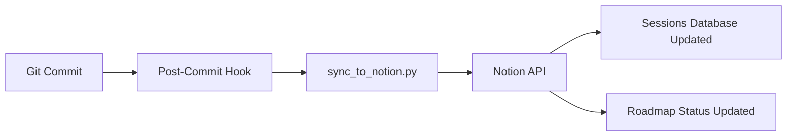
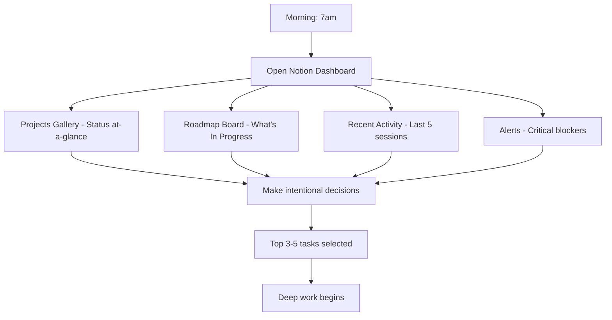
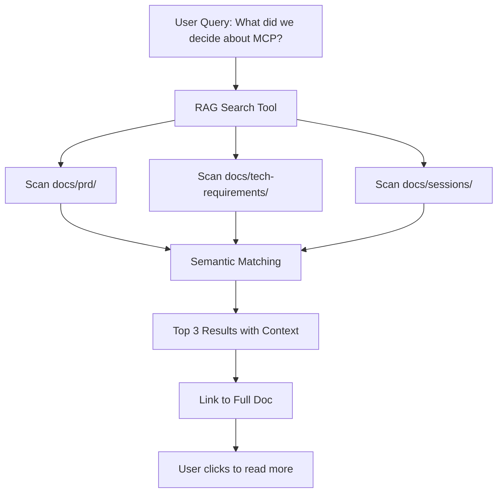

# Strategy Board - Batch 1: Context Sync Bridge

## Initiative 1: Git Hooks + Notion Sync ✅ COMPLETE

**Category**: Context Sync Bridge  
**Status**: ✅ Complete  
**Impact Score**: 9  
**Leverage Points**: #6 Information Flows, #5 Rules, #9 Delays  
**Leverage Score**: 76  
**Time Investment**: 8 hours  
**Urgency**: 10  
**Priority Score**: 89.9  
**Unblocks**: Dashboard, All future Notion integrations, Real-time project status  
**Blocked By**: None  
**Completed Date**: 2025-11-08  
**Validation Gate**: Commit → Notion updates in <30 seconds. Session logs auto-created. ✅ VALIDATED via Session: 2025-11-08 - Claude Code  
**Decision Notes**: CRITICAL FOUNDATION - Eliminates 1-3 day lag in manual documentation updates. Creates bidirectional sync between Git (source of truth) and Notion (dashboard). Enables all downstream features that depend on real-time data. Session log proves this is working perfectly.

**Systems Diagram**: 

---

## Initiative 2: Notion Command Center Dashboard

**Category**: Context Sync Bridge  
**Status**: 🟢 Ready to Build  
**Impact Score**: 8  
**Leverage Points**: #6 Information Flows, #5 Rules  
**Leverage Score**: 74  
**Time Investment**: 7 hours  
**Urgency**: 8  
**Priority Score**: 76.7  
**Unblocks**: Morning ritual optimization, Energy management system, Daily workflow clarity  
**Blocked By**: Git Hooks (✅ Complete - no longer blocked!)  
**Validation Gate**: Dashboard shows accurate project status, <15 min morning ritual, accessible from mobile, all data real-time  
**Decision Notes**: DAILY WORKFLOW OPTIMIZATION - Creates the "cockpit" from Philosophy & Strategy. Visual command center for 15-min morning ritual showing: Active projects gallery, In Progress roadmap board, Recent activity timeline, Critical alerts. Directly addresses "Failure Mode #3: Context-Switching Tax" by providing single source of truth.

**Systems Diagram**:

---

## Initiative 3: RAG Search (Repo-Only)

**Category**: Context Sync Bridge  
**Status**: 📋 Backlog  
**Impact Score**: 6  
**Leverage Points**: #6 Information Flows  
**Leverage Score**: 72  
**Time Investment**: 7 hours  
**Urgency**: 3  
**Priority Score**: 48.9  
**Unblocks**: Faster decision lookup, Cross-project insights  
**Blocked By**: Multi-project expansion (need multiple projects with docs to search meaningfully)  
**Validation Gate**: Search returns relevant results in <2 seconds, Top 3 results include source file + excerpt, Links back to full document  
**Decision Notes**: QUALITY-OF-LIFE IMPROVEMENT - Semantic search across docs/ only (NOT Notion yet, deferred to Tier 1). Enables instant answers to "What did we decide about X?" without manual grep. 90% of queries are about current project work, not old notes. Tier 0 focused on proving concept before expanding to Notion PARA integration. Lower priority because MCP tools + structured docs already enable fast context loading.

**Systems Diagram**:

---

## Deletion Instructions

Please delete these 3 test entries from the Strategy Board:
1. Voice Memo Transcription Pipeline
2. Energy Tracking Dashboard  
3. Cross-Reference Automation System

---

## Summary

- **Batch 1 Total**: 3 initiatives (1 complete, 1 ready, 1 backlog)
- **Tier 0 Status**: Phase 2 complete, Phase 4 ready to build, Phase 5 in backlog
- **Next Batch**: Legacy AI Integration, Voice-to-Notion Enhancements

**Priority Order** (based on Priority Score):
1. ✅ Git Hooks + Notion Sync (89.9) - COMPLETE
2. 🟢 Notion Command Center Dashboard (76.7) - READY TO BUILD NEXT
3. 📋 RAG Search (48.9) - Backlog until multi-project validated
