```mermaid
graph TD
    A[Calendar Event: Customer Interview Tomorrow 10am] --> B[24h Before: Generate Brief]
    B --> C[Pull: Last conversation notes]
    B --> D[Pull: Open questions for them]
    B --> E[Pull: Product updates since last talk]
    C --> F[Pre-Meeting Brief in Notion]
    D --> F
    E --> F
    F --> G[Morning Ritual: Review Brief]
    G --> H[Meeting Starts: Full Context Loaded]
    H --> I[Voice Recording During Meeting]
    I --> J[Post-Meeting: Auto-Debrief]
    J --> K[Extract Action Items → Tasks]
    J --> L[Extract Insights → Legacy AI Project]
    J --> M[Update Contact Record]
```

# Strategy Board - Batch 2: Legacy AI & Voice-to-Notion Expansion

## LEGACY AI INTEGRATION (3 Initiatives)

### Initiative 4: Multi-Project Expansion (Context Sync Bridge)

**Category**: Legacy AI Integration  
**Status**: 🟢 Ready to Build  
**Impact Score**: 9  
**Leverage Points**: #4 Self-Organization, #6 Information Flows, #5 Rules  
**Leverage Score**: 96  
**Time Investment**: 5 hours  
**Urgency**: 9  
**Priority Score**: 93.4  
**Unblocks**: Customer Interview Workflows, Learning Note Formatter, Feature Roadmap Building, Legacy AI product development acceleration  
**Blocked By**: Nothing! Infrastructure already supports this  
**Validation Gate**: 
- Can create PRDs/docs for "Legacy AI" project
- Customer interview notes auto-organized under Legacy AI
- Context Sync Bridge works for 2+ projects simultaneously
- "Start session: Legacy AI" loads customer discovery context

**Decision Notes**: 
CRITICAL MULTI-PROJECT SCALABILITY PROOF - This validates Context Sync Bridge works for multiple projects, not just Epic 2nd Brain. Creates proper structure for Legacy AI customer discovery (5+ interviews done, 25 to go). Enables organizing insights before prototyping phase in December. High leverage because it proves #4 Self-Organization (system adapts to new projects without manual reconfiguration). Directly advances $5k MRR goal by organizing customer insights for product decisions.

**Why Now**: 
- You have 5+ interviews already done with unstructured insights
- December prototype phase needs organized customer data
- Proves Context Sync Bridge scales (key success criteria from PRD)
- Only 5 hours vs weeks of manual organization later

**Systems Diagram**:

---

### Initiative 5: Customer Interview Analysis Workflow

**Category**: Legacy AI Integration  
**Status**: 🟡 Needs Decision  
**Impact Score**: 8  
**Leverage Points**: #6 Information Flows, #5 Rules, #7 Reinforcing Loop Strength  
**Leverage Score**: 78  
**Time Investment**: 6 hours  
**Urgency**: 8  
**Priority Score**: 77.4  
**Unblocks**: Feature prioritization, Jobs-to-be-Done framework application, Product roadmap clarity  
**Blocked By**: Multi-Project Expansion (need Legacy AI structure first)  
**Validation Gate**:
- Interview transcripts auto-routed to Legacy AI project
- Key insights extracted and tagged
- Pain points/jobs-to-be-done automatically identified
- Patterns visible across 5+ interviews
- Feature ideas generated from customer quotes

**Decision Notes**:
CUSTOMER DISCOVERY ACCELERATION - You've done 5+ interviews (Uncle Bob, Aunt Missy, Linisha, Carrie Esker, Suzanne, Rob) with rich insights scattered across Notion. This workflow systematically extracts: pain points, jobs-to-be-done, feature requests, emotional triggers, objections. Creates reinforcing loop (#7): Better insights → Better product decisions → Better customer outcomes → More referrals. Applies your "Jobs-to-be-Done" framework systematically instead of ad-hoc.

**Why This Matters**:
- 25 more interviews coming - need system before overwhelmed
- December prototype phase needs prioritized feature list
- Current: Manual analysis in separate docs (slow, inconsistent)
- Future: Automated extraction + pattern detection across interviews

**Decision Needed**: 
Should this use GPT-4 for analysis quality, or GPT-3.5 for cost? Recommendation: GPT-4 - customer insights are too valuable to risk lower quality extraction.

**Systems Diagram**:

---

### Initiative 6: Learning Note Formatter (GPT-4 Post-Processing)

**Category**: Voice-to-Notion Pipeline  
**Status**: 🟢 Ready to Build  
**Impact Score**: 7  
**Leverage Points**: #6 Information Flows, #5 Rules  
**Leverage Score**: 74  
**Time Investment**: 4 hours  
**Urgency**: 7  
**Priority Score**: 66.6  
**Unblocks**: Structured interview notes, Better meeting notes, Learning content organization  
**Blocked By**: Nothing - Groq integration already handles transcription  
**Validation Gate**:
- Long-form content (10+ min) auto-detected
- Formatted with: Title, Executive Summary, Sections, Action Items
- Original voice preserved but cleaned up
- Grammar/flow improved while maintaining intent
- Notion-ready markdown output

**Decision Notes**:
LONG-FORM CONTENT QUALITY - Currently, customer interview transcripts are raw dumps (hard to review, extract insights). This adds GPT-4 formatting layer that structures content while preserving authentic voice. Detects learning keywords (book, lecture, interview, podcast) + duration >10 min. Creates reusable knowledge base entries. Different from analysis (#5) - this is formatting, not insight extraction.

**Example Use Cases**:
- Customer interviews: Raw transcript → Structured Q&A format
- Book notes: Voice recording → Organized sections with action items
- Podcast notes: Stream-of-consciousness → Clean outline with key points
- Meeting notes: Scattered thoughts → Executive summary + decisions

**Why 4 Hours**:
- 1 hour: Detection logic (keywords + duration check)
- 1 hour: Formatter module (GPT-4 prompting for structure)
- 1 hour: Notion integration (formatted output)
- 1 hour: Testing + prompt refinement

**Systems Diagram**:

---

## VOICE-TO-NOTION PIPELINE EXPANSION (3 Initiatives)

### Initiative 7: Email Intelligence Integration

**Category**: Calendar & Email  
**Status**: 🟡 Needs Decision  
**Impact Score**: 7  
**Leverage Points**: #6 Information Flows, #5 Rules, #8 Balancing Loop Strength  
**Leverage Score**: 76  
**Time Investment**: 10 hours  
**Urgency**: 5  
**Priority Score**: 63.0  
**Unblocks**: Stakeholder communication automation, Customer email routing, Reduced email overhead  
**Blocked By**: Decision on email provider integration (Gmail API? Zapier?)  
**Validation Gate**:
- Important emails auto-routed to Notion
- Action items extracted from emails
- Email context available during sessions
- Auto-draft replies for common patterns
- <30 min daily email time (down from 45-60 min)

**Decision Notes**:
STAKEHOLDER MANAGEMENT AUTOMATION - You spend 45-60 min/day on email (stakeholders, customers, coaches, contractors). This creates intelligence layer: (1) Route important emails to Notion with context, (2) Extract action items → tasks, (3) Suggest reply templates for common patterns, (4) Link emails to relevant projects. Creates balancing loop (#8): Email volume increases → Auto-routing prevents overwhelm → Inbox stays manageable.

**Why Medium Priority**:
- High value (saves 15-30 min/day) but not urgent (email working okay now)
- Complexity: Email provider APIs, OAuth, privacy considerations
- Alternative: Can manually forward important emails to Notion for now

**Decision Needed**:
- Gmail API (full access, privacy concerns) vs Zapier (limited, but simpler)?
- Auto-draft replies: Yes or no? (Could feel impersonal)
- Which email categories to auto-route? (Customer inquiries, coach check-ins, contractor updates?)

**Systems Diagram**:

---

### Initiative 8: Calendar Integration & Meeting Prep

**Category**: Calendar & Email  
**Status**: 🟡 Needs Decision  
**Impact Score**: 8  
**Leverage Points**: #6 Information Flows, #5 Rules  
**Leverage Score**: 74  
**Time Investment**: 10 hours  
**Urgency**: 6  
**Priority Score**: 67.0  
**Unblocks**: Pre-meeting context loading, Better customer interviews, Coach session prep  
**Blocked By**: Decision on calendar provider (Google Calendar API?)  
**Validation Gate**:
- Auto-generate pre-meeting briefs (who, context, last interaction, open items)
- Meeting notes auto-created in Notion
- Post-meeting action items extracted
- Calendar shows in Dashboard morning ritual
- Voice notes during meetings auto-linked to calendar event

**Decision Notes**:
MEETING PRESENCE OPTIMIZATION - Your Philosophy & Strategy emphasizes "Presence Over Performance" - mental bandwidth consumed by "what should I ask?" reduces listening quality. This enables: (1) Pre-meeting brief with full context (last conversation, open questions, project status), (2) During meeting: Focus on listening (voice recorder captures all), (3) Post-meeting: Auto-debrief creates tasks and updates projects. Especially valuable for customer interviews where presence = better insights.

**Why This Matters**:
- You have 25+ customer interviews coming (need prep automation)
- Weekly coach sessions with Peter, Kevin, Meredith (need context loaded)
- Contractor meetings (need action items tracked)
- Current: Manual prep 10-15 min/meeting = 60-90 min/week wasted

**Decision Needed**:
- Google Calendar API direct integration vs Zapier?
- Auto-create Notion page for every meeting or only tagged ones?
- Should voice notes during meetings auto-link to calendar event?

**Systems Diagram**:

---

### Initiative 9: Switchback Time Tracking Integration

**Category**: Voice-to-Notion Pipeline  
**Status**: 🟢 Ready to Build  
**Impact Score**: 6  
**Leverage Points**: #6 Information Flows, #8 Balancing Loop Strength  
**Leverage Score**: 74  
**Time Investment**: 3 hours  
**Urgency**: 4  
**Priority Score**: 46.7  
**Unblocks**: Accurate time allocation data, Energy pattern analysis, Productivity insights  
**Blocked By**: Nothing - voice pipeline already supports this  
**Validation Gate**:
- Voice note "TS: deep work" creates time entry
- Weekly report: Actual time allocation vs planned
- Time data feeds Energy System tracking
- <2 min overhead per day for tracking

**Decision Notes**:
TIME REALITY CHECK - From Systems Thinking Workbook: "Switchback Method for Context Tracking" using voice notes with "TS:" prefix. Creates balancing loop (#8): Time perception vs reality → Track actual allocation → Adjust plans based on data → Better estimates. Low urgency but high ROI because it reveals where time actually goes (vs where you think it goes). Only 3 hours to implement because voice pipeline already handles this pattern.

**Why Low Priority**:
- Nice-to-have insight, not critical path
- Can manually track for now if needed
- Higher priorities unlock more immediate value

**Example Usage**:
- "TS: customer interview" (logs start of customer interview time block)
- "TS: deep work Epic 2nd Brain" (logs deep work session)
- "TS: context switching" (logs interruptions)
- Weekly: Dashboard shows actual allocation vs ideal week

**Systems Diagram**:

---

## BATCH 2 SUMMARY

**Total Initiatives**: 6 (3 Legacy AI, 3 Voice-to-Notion)

**By Status**:
- 🟢 Ready to Build: 3 (Multi-Project, Learning Formatter, Switchback)
- 🟡 Needs Decision: 3 (Interview Analysis, Email, Calendar)

**By Urgency**:
- High (7-9): 4 initiatives
- Medium (5-6): 2 initiatives
- Low (4): 1 initiative

**Priority Ranking** (by calculated Priority Score):
1. Multi-Project Expansion (93.4) - HIGHEST PRIORITY
2. Customer Interview Analysis (77.4)
3. Calendar Integration (67.0)
4. Learning Note Formatter (66.6)
5. Email Intelligence (63.0)
6. Switchback Tracking (46.7)

**Recommended Build Order**:
1. **Week 1**: Multi-Project Expansion (5h) - Unblocks Legacy AI work
2. **Week 1**: Learning Note Formatter (4h) - Quick win, immediate value
3. **Week 2**: Customer Interview Analysis (6h) - After multi-project structure exists
4. **Week 2**: Switchback Tracking (3h) - Quick addition to voice pipeline
5. **Week 3+**: Email + Calendar (need decisions first, 20h total)

---

## DECISIONS NEEDED

Before adding to Notion, need your input on:

1. **Customer Interview Analysis**: GPT-4 (quality) or GPT-3.5 (cost)?
   - Recommendation: GPT-4 - insights too valuable

2. **Email Integration**: Gmail API (full control) or Zapier (simpler)?
   - Recommendation: Start with Zapier (faster to validate)

3. **Calendar Integration**: Auto-create Notion page for ALL meetings or only tagged?
   - Recommendation: Only tagged meetings (customer interviews, coach sessions)

4. **Should we add these 6 to Strategy Board now?**
   - Or want to see Batch 3 (Energy System, Infrastructure) first?

---

**What do you think? Should I:**
- Add all Batch 2 initiatives now? (with "Needs Decision" status for unclear ones)
- Show Batch 3 first? (Energy System experiments, Infrastructure items)
- Make decision calls on the 3 unclear ones before adding?
